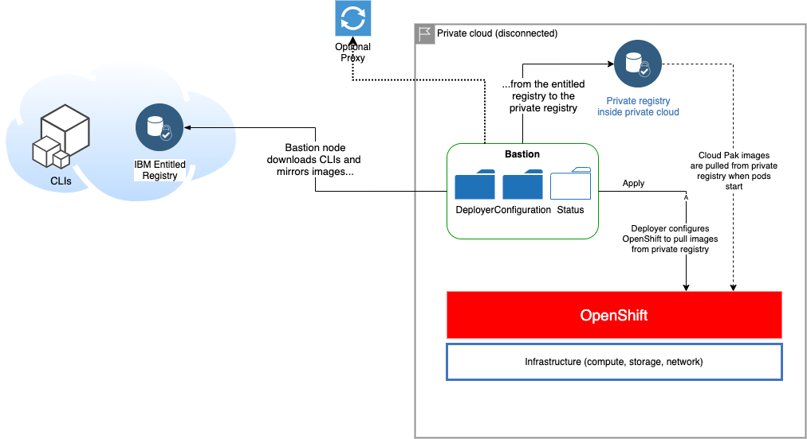
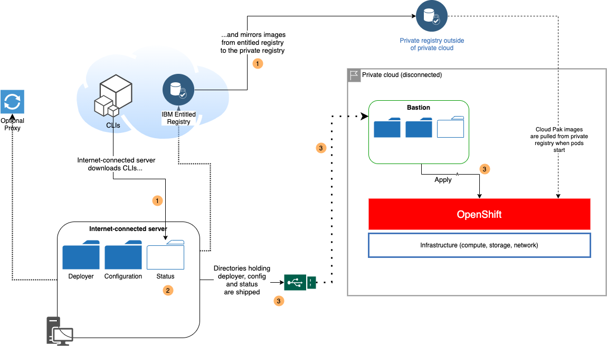
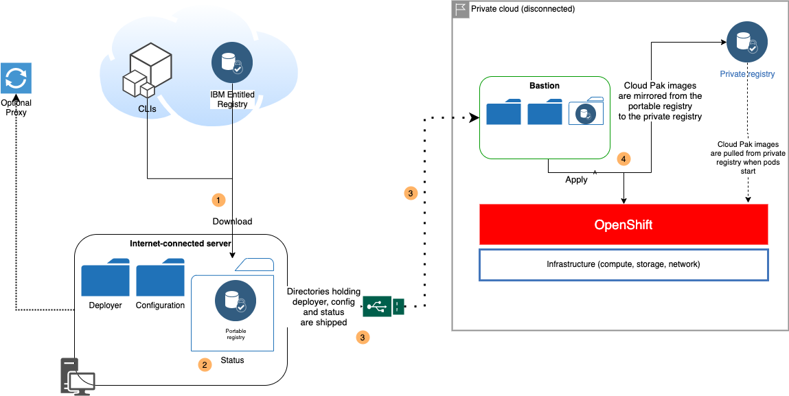

# Using a private registry

Some environments, especially in situations where the OpenShift cannot directly connect to the internet, require a private registry for OpenShift to pull the Cloud Pak images from. The Cloud Pak Deployer can mirror images from the entitled registry to a private registry that you want to use for the Cloud Pak(s). Also, if infrastructure which holds the OpenShift cluster is fully disconnected from the internet, the Cloud Pak Deployer can build a registry which can be stored on a portable hard disk or pen drive and then shipped to the site.

<InlineNotification kind="info">
    Note: In all cases, the deployer can work behind a proxy to access the internet. Go to [Running behind proxy](#running-behind-a-proxy) for more information.
</InlineNotification>

The below instructions are not limited to disconnected (air-gapped) OpenShift clusters, but are more generic for deployment using a private registry.

There are three methods for mirroring images to a private registry and using this to install the Cloud Pak(s):
* [Method 1 - Mirror images and install using a bastion server](#method-1-mirror-images-and-install-using-a-bastion-server). The bastion server can connect to the internet (directly or via a proxy), to OpenShift and to the private registry used by the OpenShift cluster.
* [Method 2 - Mirror images with a connected server, install using a bastion](#method-2-mirror-images-with-a-connected-server-install-using-a-bastion). The connected server can connect to the internet and to the private registry used by the OpenShift cluster. The server cannot connect to the OpenShift cluster. The bastion server can connect to the private registry and to the OpenShift cluster.
* [Method 3 - Mirror images using a portable image registry](#method-3-mirror-images-using-a-portable-image-registry). The private registry used by the OpenShift cluster cannot be reached from the server that is connected to the internet. You need a portable registry to download images and which you then ship to a server that can connect to the **existing** OpenShift cluster and its private registry.

Methods 1 and 3 are also outlined in the Cloud Pak for Data installation documentation: https://www.ibm.com/docs/en/cloud-paks/cp-data/4.5.x?topic=tasks-mirroring-images-your-private-container-registry

For specifying a private registry in the Cloud Pak Deployer configuration, please see [Private registry](/cpd-design/components/private-registry). Example of specifying a private registry with a self-signed certificate in the configuration:
```
image_registry:
- name: cpd453
  registry_host_name: registry.coc.ibm.com
  registry_port: 5000
  registry_insecure: True
```

The `cp4d` instance must reference the `image_registry` object using the `image_registry_name`:
```
cp4d:
- project: zen-45
  openshift_cluster_name: {{ env_id }}
  cp4d_version: 4.5.3
  openshift_storage_name: ocs-storage
  image_registry_name: cpd453
```

<InlineNotification kind="info">
The deployer only supports using a private registry for the Cloud Pak images, not for OpenShift itself. Air-gapped installation of OpenShift is currently not in scope for the deployer.
</InlineNotification>

The main 3 directories that are needed for both types of air-gapped installations are:
* Cloud Pak Deployer directory: `cloud-pak-deployer`
* Configuration directory: The directory that holds a all the Cloud Pak Deployer configuration
* Status directory: The directory that will hold all downloads, vault secrets and the portable registry when applicable (method 3)

## Method 1 - Mirror images and install using a bastion server
This is effectively "not-air-gapped" scenario, where a bastion server within the targeted infrastructure can connect to the internet and mirror images to the private image registry. Also, the bastion server can connect to OpenShift to install the Cloud Pak(s).



### On the bastion server connected to the internet and OpenShift cluster
* If there are restrictions regarding the internet sites that can be reached, ensure that the website domains the deployer needs are whitelisted. For a list of domains, check [locations to whitelist](/advanced/locations-to-whitelist)
* Build the Cloud Pak Deployer image using `./cp-deploy.sh build`
* Create or update the directory with the configuration; make sure all your Cloud Paks and cartridges are specified as well as an `image_registry` entry to identify the private registry
* Export the CONFIG_DIR and STATUS_DIR environment variables to respectively point to the configuration directory and the status directory
* Export the CP_ENTITLEMENT_KEY environment variable with your Cloud Pak entitlement key
* Create a vault secret holding the connection credentials for the private registry specified in the configuration (`image_registry`). For example:
```
./cp-deploy.sh vault set \
    -vs image-registry-cpd453 \
    -vsv "admin:very_s3cret"
```
* Create a vault secret holding the credentials for the OpenShift cluster. For example: 
```
./cp-deploy.sh vault set \
    -vs pluto-01-oc-login \
    -vsv "oc login api.pluto-01.coc.ibm.com:6443 -u kubeadmin -p BmxQ5-KjBFx-FgztG-gpTF3 --insecure-skip-tls-verify"
```
* Run the `./cp-deploy.sh env apply` command to start deployment of the Cloud Pak to the OpenShift cluster. For example:
```
./cp-deploy.sh env apply \
    -e env_id=pluto-01 
```
The existence of the `image_registry` definition and its reference in the `cp4d` definition instruct the deployer to mirror images to the private registry and to configure the OpenShift cluster to pull images from the private registry. If you have already mirrored the Cloud Pak images, you can add the `--skip-mirror-images` parameter to speed up the deployment process.

## Method 2 - Mirror images with a connected server, install using a bastion
This method is also sometimes referred to as "semi-air-gapped". Use this method when the private registry used by the OpenShift cluster **can be** reached from an internet-connected server. In this case the internet-connected machine can directly mirror the images to the private registry but it cannot do anything on the OpenShift cluster. A bastion server is used to connect to the OpenShift cluster and to install the Cloud Pak(s).



<InlineNotification kind="warning">
Please note that in this case the Cloud Pak Deployer expects an OpenShift cluster to be available already and will only work with an `existing-ocp` configuration. The bastion server does not have access to the internet and can therefore not instantiate an OpenShift cluster.
</InlineNotification>

### On the server connected to the internet
* If there are restrictions regarding the internet sites that can be reached, ensure that the website domains the deployer needs are whitelisted. For a list of domains, check [locations to whitelist](/advanced/locations-to-whitelist)
* Build the Cloud Pak Deployer image using `./cp-deploy.sh build`
* Create or update the directory with the configuration; make sure all your Cloud Paks and cartridges are specified as well as an `image_registry` entry to identify the private registry
* Export the CONFIG_DIR and STATUS_DIR environment variables to respectively point to the configuration directory and the status directory
* Export the CP_ENTITLEMENT_KEY environment variable with your Cloud Pak entitlement key
* Create a vault secret holding the connection credentials for the private registry specified in the configuration (`image_registry`). For example:
```
./cp-deploy.sh vault set \
    -vs image-registry-cpd453 \
    -vsv "admin:very_s3cret"
```
If the status directory does not exist it is created at this point
* **Diagram step 1**. Run the deployer using the `./cp-deploy.sh env download --skip-portable-registry` command. For example:
```
./cp-deploy.sh env download \
    -e env_id=pluto-01 \
    --skip-portable-registry
```
This will download all clients and then mirror images from the entitled registry to the privatte registry. If mirroring fails, fix the issue and just run the `env download` again.
* Before saving the status directory, you can optionally remove the entitlement key from the vault:
```
./cp-deploy.sh vault delete \
    -vs cp_entitlement_key
```
* **Diagram step 2**. When the download finished successfully, re-run the deployer with `./cp-deploy.sh env save` command to save the deployer container image to the status directory. For example:
```
./cp-deploy.sh env save
```
* **Diagram step 3**. Ship the `cloud-pak-deployer` direcory and configuration and status directories to a server that can be connected to the private registry and the OpenShift cluster. The total size of the directories should be relatively small, typically < 5 GB

### On the bastion server that is not connected to the internet but is connected to the private registry and OpenShift cluster
* **Diagram step 3**. Restore the directories to the bastion server
    * `cloud-pak-deployer` directory
    * Configuration directory
    * Status directory
* **Diagram step 4**. Use the instructions in [Run on existing OpenShift](/cp-deploy/run/run-on-existing-openshift), adding the `--air-gapped` and `--skip-mirror-images` flags, to start the deployer:
    * Export the CONFIG_DIR and STATUS_DIR environment variables to respectively point to the configuration directory and the status directory
    * Set the CPD_AIRGAP environment variable to `true`
    ```
    export CPD_AIRGAP=true
    ```
    * Create a vault secret holding the credentials for the OpenShift cluster. For example: 
    ```
    ./cp-deploy.sh vault set \
        -vs pluto-01-oc-login \
        -vsv "oc login api.pluto-01.coc.ibm.com:6443 -u kubeadmin -p BmxQ5-KjBFx-FgztG-gpTF3 --insecure-skip-tls-verify"
    ```
    * Run the `./cp-deploy.sh env apply --skip-mirror-images` command to start deployment of the Cloud Pak to the OpenShift cluster. For example:
    ```
    ./cp-deploy.sh env apply \
        -e env_id=pluto-01 \
        --skip-mirror-images
    ```    
    The `CPD_AIRGGAP` environment variable tells the deployer it will not download anything from the internet; `--skip-mirror-images` indicates that images are already available in the private registry that is included in the configuration (`image_registry`)

## Method 3 - Mirror images using a portable image registry
Use this method when the private registry used by the OpenShift cluster cannot be reached from an internet-connected server. In this case you need a portable registry to download images and which you then ship to a server that can connect to the OpenShift cluster and its private registry.



<InlineNotification kind="warning">
Please note that in this case the Cloud Pak Deployer expects an OpenShift cluster to be available already and will only work with an `existing-ocp` configuration. The bastion server does not have access to the internet and can therefore not instantiate an OpenShift cluster.
</InlineNotification>

### On the computer connected to the internet
* If there are restrictions regarding the internet sites that can be reached, ensure that the website domains the deployer needs are whitelisted. For a list of domains, check [locations to whitelist](/advanced/locations-to-whitelist)
* Build the Cloud Pak Deployer image using `cp-deploy.sh build`
* Create or update the directory with the configuration, making sure all your Cloud Paks and cartridges are specified
* Export the CONFIG_DIR and STATUS_DIR environment variables to respectively point to the configuration directory and the status directory
* Export the CP_ENTITLEMENT_KEY environment variable with your Cloud Pak entitlement key
* **Diagram step 1**. Run the deployer using the `./cp-deploy.sh env download` command. For example:
```
./cp-deploy.sh env download \
    -e env_id=pluto-01
```
This will download all clients, start the portable registry and then mirror images from the entitled registry to the portable registry. The portable registry data is kept in the status directory. If mirroring fails, fix the issue and just run the `env download` again.
* Before saving the status directory, you can optionally remove the entitlement key from the vault:
```
./cp-deploy.sh vault delete \
    -vs cp_entitlement_key
```
* **Diagram step 2**. When the download finished successfully, run the deployer with `./cp-deploy.sh env save` command to stop the portable registry and save the deployer container image to the status directory. For example:
```
./cp-deploy.sh env save
```
* **Diagram step 3**. Ship the `cloud-pak-deployer` direcory and configuration and status directories to a server that can be connected to the private registry and the OpenShift cluster. The status directory now holds all assets required for the air-gapped installation and its size can be substantial (100+ GB). You may want to use multi-volume tar files if you are using network transfer

### On the bastion server that is not connected to the internet but is connected to the private registry and OpenShift cluster
* **Diagram step 3**. Restore the directories to the bastion server
    * `cloud-pak-deployer` directory
    * Configuration directory
    * Status directory
* **Diagram step 4**. Below we use the instructions in [Run on existing OpenShift](/cp-deploy/run/run-on-existing-openshift) to start the deployer, adapting the steps to an air-gapped OpenShift cluster:
    * Export the CONFIG_DIR and STATUS_DIR environment variables to respectively point to the configuration directory and the status directory
    * Set the CPD_AIRGAP environment variable to `true`
    ```
    export CPD_AIRGAP=true
    ```
    * Create a vault secret holding the credentials for the OpenShift cluster. For example: 
    ```
    ./cp-deploy.sh vault set \
        -vs pluto-01-oc-login \
        -vsv "oc login api.pluto-01.coc.ibm.com:6443 -u kubeadmin -p BmxQ5-KjBFx-FgztG-gpTF3 --insecure-skip-tls-verify"
    ```
    * Create a vault secret holding the connection credentials for the private registry specified in the configuration (`image_registry`). For example:
    ```
    ./cp-deploy.sh vault set \
        -vs image-registry-cpd453 \
        -vsv "admin:very_s3cret"
    ```
    * Run the `./cp-deploy.sh env apply` command to start deployment of the Cloud Pak to the OpenShift cluster. For example:
    ```
    ./cp-deploy.sh env apply \
        -e env_id=pluto-01
    ```  
    The `CPD_AIRGGAP` environment variable tells the deployer it will not download anything from the internet. As a first action, the deployer mirrors images from the portable registry to the private registry included in the configuration (`image_registry`)

## Running behind a proxy
If the Cloud Pak Deployer is run from a server that has the HTTP proxy environment variables set up, it will also use these settings in the deployer container. The following environment variables are automatically applied if set up in the session running the `cp-deploy.sh` command:
* `http_proxy`
* `https_proxy`
* `no_proxy`

If you do not want the deployer to use the proxy environment variables, you must remove them before running the `cp-deploy.sh` command:
```
unset http_proxy
unset https_proxy
unset no_proxy
```

## Special settings for debug and DaemonSet images in air-gapped mode
Specifically when running the deployer on IBM Cloud ROKS, certain OpenShift settings must be applied using DaemonSets in the `kube-system` namespace. Additionally, the deployer uses the `oc debug node` commands to retrieve `kubelet` and `crio` configuration files from the compute nodes.

The default container images used by the DaemonSets and `oc debug node` commands are based on Red Hat's Universal Base Image and will be pulled from Red Hat registries. This is typically not possible in air-gapped installations, hence different images must be used. It is your responsibility to copy suitable (preferably UBI) images to an image registry that is connected to the OpenShift cluster. Also, if a pull secret is needed to pull the image(s) from the registry, you must create the associated secret in the `kube-system` OpenShift project.

To configure alternative container images for the deployer to use, set the following properties in the `.inv` file kept in your configuration's `inventory` directory, or specify them as additional command line parameters for the `cp-deploy.sh` command. 

If you do not set these values, the deployer assumes that the default images are used for DaemonSet and `oc debug node`.

| Property             | Description                                            | Example                        |
| -------------------- | ------------------------------------------------------ | ------------------------------ |
| cpd_oc_debug_image   | Container image to be used for the `oc debug` command. | `registry.redhat.io/rhel8/support-tools:latest` |
| cpd_ds_image         | Container image to be used for the DaemonSets that configure Kubelet, etc. | `registry.access.redhat.com/ubi8/ubi:latest` |

Example of using with `cp-deploy.sh`
```
./cp-deploy.sh env apply --air-gapped -e cpd_oc_debug_image=registry.redhat.io/rhel8/support-tools:latest
```