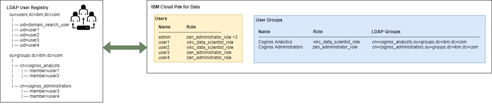

# Cloud Pak Deployer Configuration

The Cloud Pak Deployer includes several sample configurations which you can use as a basis for your own configuration. You can find them in the `sample-configurations` directory of the repository. Copy the sample configuration directory you want to use to your own directory. 

<InlineNotification kind="warning">
It is best not to place it under the repository directory structure, otherwise you may not be able to update (pull) the repository with changes applied on github.ibm.com.
</InlineNotification>

Every configuration have 3 subdirectories:
* `config`: Keeps one or more YAML files with your OpenShift and Cloud Pak configuration
* `defaults`: Keeps the defaults which will be merged with your configuration
* `inventory`: Holds global settings for the configuration such as environment name and type of vault you want to use

You can choose to keep only a single file per subdirectory, or for more complex configurations, you can create multiple yaml files. The generator automatically merges all files in the config and defaults directory.

## `config` directory
Create one or more yaml files holding the configuration you want to provision. You can create Virtual Private Clouds (VPCs), Security rules, Virtual Server Instances (VSIs), OpenShift clusters, Cloud Pak for Data instances and a few more, simply by adding yaml constructs to files in this directory.

You can find a full list of all supported object types here:
[Configuration objects](/cpd-design/objects)

## `defaults` directory
TODO: To be completed

## `inventory` directory
The Cloud Pak Deployer pipeline has been built using Ansible and it can be configured using "inventory" files. Inventory files hold the global parameters which are available throughout the Ansible playbooks. One of the most important configurations you will find in the Cloud Pak Deployer's inventory files is the vault configuration.

### Vault configuration
Throughout the deployment process, the Cloud Pak Deployer will create secrets in a vault and retrieve them later. Examples of secrets are: ssh keys, Cloud Pak for Data admin password. Additionally, when provisioning infrastructure no the IBM Cloud, the resulting Terraform state file is also stored in the vault so it can be used later if the configuration needs to be changed.

The following Vault implementations can be used to store and retrieve secrets:
- File Vault (no encryption)
- IBM Cloud Secrets Manager
- Hashicorp Vault (token authentication)
- Hashicorp Vault (certificate authentication)

Detailed descriptions of the vault settings can be found in the sample inventory file and also here: [vault settings](/cpd-design/objects/vault.mdx).

The **File Vault** is the default vault and also the simplest. It does not require a password and all secrets are stored in base-64 encoding in a properties file under the `<status_directory>/vault` directory. The name of the vault file is the `environment_name` you specified in the inventory file or at the command line.

All of the other vault options require some secret manager (IBM Cloud service or Hashicorp Vault) to be available and you need to specify a password or provide a certificate.

### Cloud Pak for Data LDAP configuration

IBM Cloud Pak for Data can connect to an LDAP user registry in order for users to log on with their LDAP credentials. The configuration of LDAP can be specified in a seperate yaml file in the `config` folder:  [Example LDAP and User Group settings](/cpd-design/objects/ldap_user_groups).

An `ldap_config` entry contains the connectivity information to the LDAP user registry. The `project` and `openshift_cluster_name` values uniquely identify the Cloud Pak for Data cluster instance.
The `ldap_domain_search_password_vault` entry contains a reference to the vault, which means that as a preparation the LDAP bind user password must be stored in the vault used by the Cloud Pak Deployer using the key referenced in the configuration. 
If the password is not available, the Cloud Pak Deployer will fail and not able to configure the LDAP connectivity.

### Cloud Pak for Data User Group configuration
The `ldap_config` can optionally create User Group(s) with references to LDAP Group(s). A `user_groups` entry must contain at least 1 `role_assignments` and 1 `ldap_groups` entry.

**Role Assignment values:**
- zen_administrator_role
- zen_user_role
- wkc_data_scientist_role
- zen_developer_role
- zen_data_engineer_role (requires installation of DataStage cartridge to become available)

During the creation of User Group(s) the following validations are performed:
- LDAP configuration is completed
- The provided role assignment(s) are available in Cloud Pak for Data
- The provided LDAP group(s) are available in the LDAP registry
- If the User Group already exists, it ensures the provided LDAP Group(s) are assigned, but no changes to the existing role assignments are performed and no LDAP groups are removed from the User Group

### Cloud Pak for Data provisioned instance authorization
When using Cloud Pak for Data LDAP connectivity and User Groups, the User Groups can be assigned to authorize the users of the LDAP groups access to the proviosioned instance(s).
[Example Cloud Pak for Data instance configuration](/cpd-design/objects/cp4d_instance_configuration).

Currently supported instance authorization:  
- Cognos Analytics (ca)

#### Cognos Analytics instance authorization

A Cognos Analytics (ca) instance can have multiple `manage_access` entries. Each entry consists of 1 `ca_role` and 1 `cp4d_user_group` element. 
The `ca_role` must be one of the following possible values:
- Analytics Administrators
- Analytics Explorers
- Analytics Users 
- Analytics Viewer

During the configuration of the instance authorization the following validations are performend:
- LDAP configuration is completed
- The provided `ca_role` is valid
- The provided `cp4d_user_group` exists

