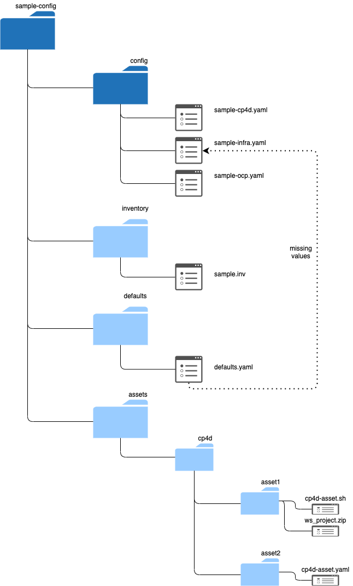

# Cloud Pak Deployer Configuration

The Cloud Pak Deployer includes several sample configurations which you can use as a basis for your own configuration. You can find them in the `sample-configurations` directory of the repository. You can either take one of the included examples or copy a sample configuration directory you want to use to your own directory.

<InlineNotification kind="warning">
If you want to make changes to the example configurations, it is best to copy the example directory and not to place it under the repository directory structure, otherwise you may not be able to update (pull) the repository with changes applied on github.ibm.com.
</InlineNotification>

Example of copying a configuration directory to your user home directory:
```
cp -r ./sample-configurations/sample-roks-vpc-nfs-cp4d ~/sample-config
```

## Typical configuration steps
The sample configurations typicall work out of the box and you don't have to change anything if you're using this for a POC or test. A couple of changes you may want to do are:
* Change the install region in the `inventory/sample.inv` file
* Change the name of the OpenShift cluster to be created in the `config/sample-ocp.yaml`. If you do this, you also need to change the OpenShift cluster reference in the Cloud Pak configuration
* Select the cartridges to be installed in the `config/sample-cp4d.yaml`

The `sample-roks*` configurations work without any configuration changes and will create all referenced objects, including VPCs, SSH keys, subnets, NFS servers, OCS storage nodes if specified. There is typically no need to change address prefixes and subnets. The IP addresses used by the provisioned components are private to the VPC and are not externally exposed.

<InlineNotification kind="warning">
Do not create any of the specified objects referenced in the configuration yourself. If you manually create any of the objects, the Terraform scripts will fail when it finds that objects already exist and are not managed by Terraform in its .tfstate file.
</InlineNotification>

For more advanced configuration topics such as using a private registry, setting up transit gateways between VPCs, etc, go to [advanced configuration](/advanced/advanced-configuration)

## Directory structure

Every configuration has 3 mandatory subdirectories.


* `config`: Keeps one or more YAML files with your OpenShift and Cloud Pak configuration
* `defaults`: Keeps the defaults which will be merged with your configuration
* `inventory`: Holds global settings for the configuration such as environment name and type of vault you want to use

You can choose to keep only a single file per subdirectory, or for more complex configurations, you can create multiple yaml files. The generator automatically merges all files in the config and defaults directory.

### `config` directory
Create one or more `.yaml` files holding the configuration you want to provision. You can create Virtual Private Clouds (VPCs), Security rules, Virtual Server Instances (VSIs), OpenShift clusters, Cloud Pak for Data instances and a few more, simply by adding yaml constructs to files in this directory.

In the example configurations we have split up the configuration into 3 files:
* `sample-cp4d.yaml`: Specifies the Cloud Pak for Data instance and its cartridges, as well as specific version numbers to be installed.
* `sample-infra.yaml`: Specifies the operational implementation of the installation such as the VPCs, subnets, NFS servers, VSIs
* `sample-ocp.yaml`: Defines OpenShift specifics like worker flavour, worker count, subnets to deploy the OpenShift cluster, storage classes, etc.

You can find a full list of all supported object types here:
[Configuration objects](/cpd-design/objects/objects)

### `defaults` directory
Holds the defaults for all object types. If a certain object property has not been specified in the `config` directory, it will be retrieved from the `defaults` directory using the flavour specified in the configured object. If no flavour has been selected, the `default` flavour will be chosen.

You should not need to edit the files under this directory in most circumstances.

### `inventory` directory
The Cloud Pak Deployer pipeline has been built using Ansible and it can be configured using "inventory" files. Inventory files hold the global parameters which are available throughout the Ansible playbooks. 

The most important configuration you will find in the Cloud Pak Deployer's inventory files is the vault configuration. All samples default to the **File Vault**, meaning that the vault will be kept in the `vault` directory under the status directory you specify when you run the deployer. Detailed descriptions of the vault settings can be found in the sample inventory file and also here: [vault settings](/cpd-design/objects/vault.mdx).
