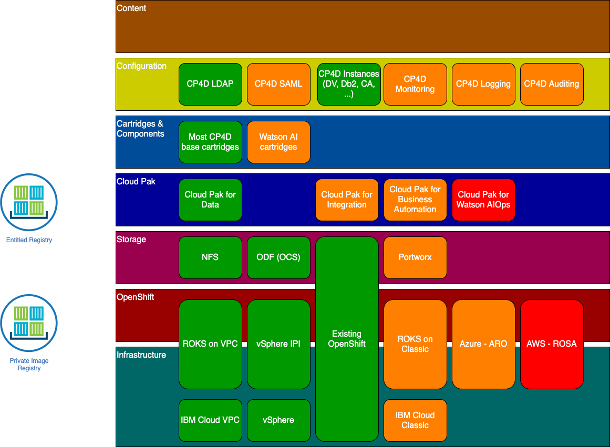

# Current state
The below picture indicates the current state of the Cloud Pak Deployer, which infrastructures are supported to provision or use OpenShift, the storage classes which can be controlled and the Cloud Paks with cartridges and components.

# Using the Cloud Pak Deployer
There are 3 main steps you need to perform to provision a Cloud Pak for Data on ROKS. We're assuming you're starting from scratch.

1. [Install the Cloud Pak Deployer](/cp-deploy/install)
2. [Configure the environment you want to deploy](/cp-deploy/configure)
3. [Run the Cloud Pak Deployer to create the cluster and install the Cloud Pak](/cp-deploy-run)
4. Optional: [Destroy the assets](/cp-deploy/destroy)
5. Optional: Run `oc` commands against the deployed environment [Open a command line](/cp-deploy/command)

## What will I need?
To complete the deployment, you will need the following. Details will be provided when you need them.
* A MacBook or Linux server/VM to run the Cloud Pak Deployer (unfortunately Microsoft Windows does not work at the moment)
* Docker or Podman installed on your MacBook or Linux server
* Git command or desktop
* A Git token to pull from the Git repository
* Your Cloud Pak entitlement key to pull images from the IBM Container Registry

Specifically, dependeding on the infrastructure:
* IBM Cloud VPC: An IBM Cloud API key that allows you to provision infrastructure
* vSphere: A vSphere user and password which has infrastructure create permissions
* Existing OpenShift: The `kubeconfig` file that allows you cluster admin access to the OpenShift cluster