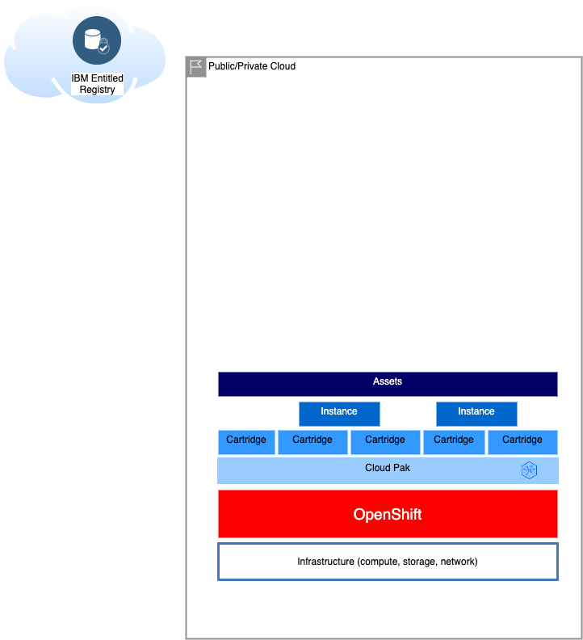
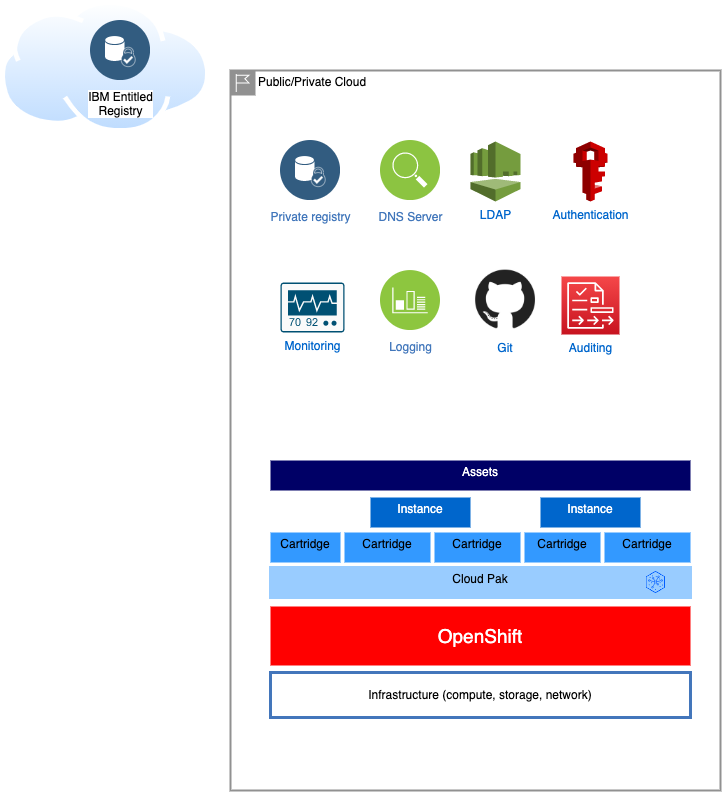

# Deployment options

## Basic deployment

For more details on each of the elements, refer to:
* [Infrastructure](/cpd-design/components/infrastructure)
* [OpenShift](/cpd-design/components/openshift)
* [Cloud Pak](/cpd-design/components/cloud-pak)
* [Cloud Pak Cartridges](/cpd-design/components/cp4d-cartridges)
* [Cloud Pak Instances](/cpd-design/components/cp4d-instances)
* [Cloud Pak Assets](/cpd-design/components/cp4d-assets)

## Extended deployment

For more details about extended deployment, refer to:
* [Monitoring](/cpd-design/components/monitoring)
* [Logging and auditing](/cpd-design/components/logging-auditing)
* [Git integration](/cpd-design/components/git)
* [Private registry and air-gapped installations](/cpd-design/components/private-registry)
* [DNS Servers](/cpd-design/components/dns)
* [Cloud Pak for Data LDAP integration](/cpd-design/components/cp4d-ldap)
* [Cloud Pak for Data SAML](/cpd-design/components/cp4d-saml)

# Current state of the Cloud Pak Deployer
The below picture indicates the current state of the Cloud Pak Deployer, which infrastructures are supported to provision or use OpenShift, the storage classes which can be controlled and the Cloud Paks with cartridges and components.

# Using the Cloud Pak Deployer
There are 3 main steps you need to perform to provision a Cloud Pak for Data on ROKS. We're assuming you're starting from scratch.

1. [Install the Cloud Pak Deployer](/cp-deploy/install)
2. [Configure the environment you want to deploy](/cp-deploy/configure)
3. [Run the Cloud Pak Deployer to create the cluster and install the Cloud Pak](/cp-deploy-run)
4. Optional: [Destroy the assets](/cp-deploy/destroy)
5. Optional: Run `oc` commands against the deployed environment [Open a command line](/cp-deploy/command)

## What will I need?
To complete the deployment, you will need the following. Details will be provided when you need them.
* A Linux server/VM to run the Cloud Pak Deployer
* Docker or Podman installed on the Linux server
* Git command or desktop
* A Git token to pull from the Git repository
* Your Cloud Pak entitlement key to pull images from the IBM Container Registry

Specifically, dependeding on the infrastructure:
* IBM Cloud VPC: An IBM Cloud API key that allows you to provision infrastructure
* vSphere: A vSphere user and password which has infrastructure create permissions
* AWS: AWS IAM credentials (access key and secret access key) and a ROSA login token
* Existing OpenShift: The `kubeconfig` file that allows you cluster admin access to the OpenShift cluster