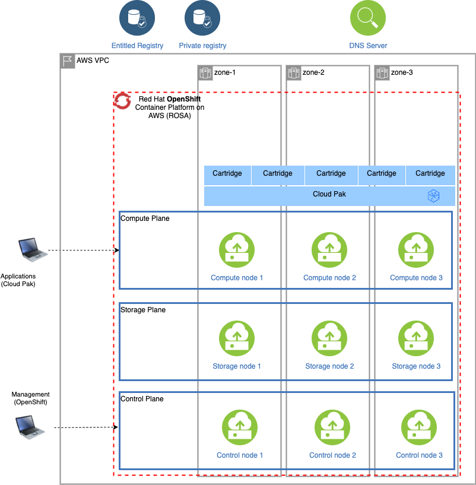

# Running the Cloud Pak Deployer on AWS (ROSA)

On Amazon Web Services (AWS), OpenShift can be set up in various ways, managed by Red Hat (ROSA) or self-managed. The steps below are applicable to the ROSA (Red Hat OpenShift on AWS) installation. More information about ROSA can be found here: https://aws.amazon.com/rosa/

## Topology

A typical setup of the ROSA cluster is pictured below:


When deploying ROSA, an external host name and domain name are automatically generated by Amazon Web Services and both the API and Ingress servers can be resolved by external clients. At this stage, one cannot configure the domain name to be used.

## Enable ROSA on AWS

Before you can use ROSA on AWS, you have to enable it if this has not been done already. This can be done as follows:

- Go to https://aws.amazon.com/
- Login to the AWS console
- Search for **ROSA service**
- Click **Enable OpenShift**

## Obtain the AWS IAM credentials

You will need an **Access Key ID** and **Secret Access Key** for the deployer to run `rosa` commands.

- Go to https://aws.amazon.com/
- Login to the AWS console
- Click on your user name at the top right of the screen
- Select **Security credentials**. You can also reach this screen via https://console.aws.amazon.com/iam/home?region=us-east-2#/security_credentials.
- If you do not yet have an access key (or you no longer have the associated secret), create an access key
- Store your **Access Key ID** and **Secret Access Key** in safe place

## Obtain your ROSA login token

To run `rosa` commands to manage the cluster, the deployer requires the ROSA login token.

- Go to https://cloud.redhat.com/openshift/token/rosa
- Login with your Red Hat user ID and password. If you don't have one yet, you need to create it.
- Copy the offline access token presented on the screen and store it in a safe place.

## Acquire an IBM Cloud Pak Entitlement Key

If you want to pull the Cloud Pak images from the entitled registry (i.e. an online install), or if you want to mirror the images to your private registry, you need to download the entitlement key. You can skip this step if you're installing from a private registry and all Cloud Pak images have already been downloaded to the private registry.

- Navigate to https://myibm.ibm.com/products-services/containerlibrary and login with your IBMId credentials
- Select **Get Entitlement Key** and create a new key (or copy your existing key)
- Copy the key value

<InlineNotification kind="warning">
  As stated for the API key, you can choose to download the entitlement key to a
  file. However, when we reference the entitlement key, we mean the 80+
  character string that is displayed, not the file.
</InlineNotification>

## Prepare for running

### Set environment variables

```
export AWS_ACCESS_KEY_ID=your_access_key
export AWS_SECRET_ACCESS_KEY=your_secret_access_key
export ROSA_LOGIN_TOKEN="your_rosa_login_token"
export CP_ENTITLEMENT_KEY=your_cp_entitlement_key

export STATUS_DIR=/data/status/sample
export CONFIG_DIR=/data/config/sample
```

- `AWS_ACCESS_KEY`: This is the AWS Access Key you retrieved above, often this is something like `AK1A2VLMPQWBJJQGD6GV`
- `AWS_SECRET_ACCESS_KEY`: The secret associated with your AWS Access Key, also retrieved above
- `ROSA_LOGIN_TOKEN`: The offline access token that was retrieved before. This is a very long string (200+ characters). Make sure you enclose the string in single or double quotes as it may hold special characters
- `CP_ENTITLEMENT_KEY`: This is the entitlement key you acquired as per the instructions above, this is a 80+ character string
- `STATUS_DIR`: The directory where the Cloud Pak Deployer keeps all status information and logs files. **Please note** that if you have chosen to use a File Vault, the properties file is keps under the `vault` directory within the status directory
- `CONFIG_DIR`: Directory that holds the configuration, it must have `config`, `defaults` and `inventory` subdirectories

<InlineNotification>
  Cloud Pak Deployer uses the status directory to logs its activities and also
  to keep track of its running state. For a given environment you're
  provisioning or destroying, you should always specify the same status
  directory to avoid contention between different deploy runs. You can run the
  Cloud Pak Deployer in parallel for different environments (different
  configuration directories).
</InlineNotification>

### Create the secrets needed for ROSA cluster

You need to store the below credentials in the vault so that the deployer has access to them when doing the ROSA install.

```
./cp-deploy.sh vault set \
    --vault-secret aws-access-key \
    --vault-secret-value $AWS_ACCESS_KEY_ID

./cp-deploy.sh vault set \
    --vault-secret aws-secret-access-key \
    --vault-secret-value $AWS_SECRET_ACCESS_KEY

./cp-deploy.sh vault set \
    --vault-secret rosa-login-token \
    --vault-secret-value $ROSA_LOGIN_TOKEN
```

## Optional: validate the configuration

If you only want to validate the configuration, you can run the dpeloyer with the `--check-only` argument. This will run the first stage to validate variables and vault secrets and then execute the generators.

```
./cp-deploy.sh env apply -e env_id=pluto-01 --check-only [--accept-all-licenses]
```

## Run the Cloud Pak Deployer

To run the container using a local configuration input directory and a data directory where temporary and state is kept, use the example below. If you don't specify the status directory, the deployer will automatically create a temporary directory. Please note that the status directory will also hold secrets if you have configured a flat file vault. If you lose the directory, you will not be able to make changes to the configuration and adjust the deployment. It is best to specify a permanent directory that you can reuse later. If you specify an existing directory the current user **must** be the owner of the directory. Failing to do so may cause the container to fail with insufficient permissions.

```
./cp-deploy.sh env apply -e env_id=pluto-01 [--accept-all-licenses]
```

In the above command, the `env_id` extra variable defines the names of the objects that are being created; these are referenced in the `.yaml` configuration files as `{{ env_id }}`. For more information about the extra (dynamic) variables, see [advanced configuration](/advanced/advanced-configuration).

The `--accept-all-licenses` flag is optional and confirms that you accept all licenses of the installed cartridges and instances. Licenses must be either accepted in the configuration files or at the command line.

When running the command, the container will start as a daemon and the command will tail-follow the logs. You can press Ctrl-C at any time to interrupt the logging but the container will continue to run in the background.

You can return to view the logs as follows:

```
./cp-deploy.sh env logs
```

Deploying the infrastructure, preparing OpenShift and installing the Cloud Pak will take a long time, typically between 1-5 hours,dependent on which Cloud Pak cartridges you configured. For estimated duration of the steps, refer to [Timings](/cpd-design/timings).

If you need to interrupt the automation, use CTRL-C to stop the logging output and then use:

```
./cp-deploy.sh env kill
```

## On failure

If the Cloud Pak Deployer fails, for example because certain infrastructure components are temporarily not available, fix the cause if needed and then just re-run it with the same `CONFIG_DIR` and `STATUS_DIR` as well extra variables. The provisioning process has been designed to be idempotent and it will not redo actions that have already completed successfully.

## Finishing up

Once the process has finished, it will output the URLs by which you can access the deployed Cloud Pak. You can also find this information under the `cloud-paks` directory in the status directory you specified.

To retrieve the Cloud Pak URL(s):

```
cat $STATUS_DIR/cloud-paks/*
```

This will show the Cloud Pak URLs:

```output
Cloud Pak for Data URL for cluster pluto-01 and project zen-40:
https://cpd-zen-40.apps.pluto-01.pmxz.p1.openshiftapps.com
```

The `admin` password can be retrieved from the vault as follows:

List the secrets in the vault:

```
./cp-deploy.sh vault list
```

This will show something similar to the following:

```output
Secret list for group sample:
- aws-access-key
- aws-secret-access-key
- ibm_cp_entitlement_key
- rosa-login-token
- pluto-01-cluster-admin-password
- cp4d_admin_zen_40_pluto_01
- all-config
```

You can then retrieve the Cloud Pak for Data admin password like this:

```
./cp-deploy.sh vault get --vault-secret cp4d_admin_zen_40_pluto_01
```

```output
PLAY [Secrets] *****************************************************************
included: /cloud-pak-deployer/automation-roles/99-generic/vault/vault-get-secret/tasks/get-secret-file.yml for localhost
cp4d_admin_zen_40_pluto_01: gelGKrcgaLatBsnAdMEbmLwGr
```

## Post-install configuration
You can find examples of a couple of typical changes you may want to do here: [Post-run changes](/cp-deploy/post-run).
