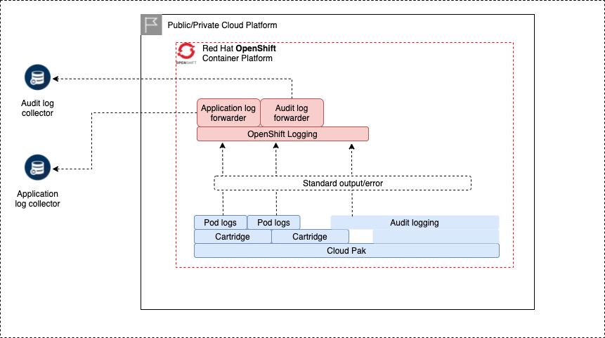

# Logging and auditing for Cloud Paks

For logging and auditing of Cloud Pak for Data we make use of the OpenShift logging framework, which delivers a lot of flexibility in capturing logs from applications, storing them in an ElasticSearch datastore in the cluster (currently not supported by the deployer), or forwarding the log entries to external log collectors such as an ElasticSearch, Fluentd, Loki and others.



OpenShift logging captures 3 types of logging entries from workload that is running on the cluster:
* infrastructure - logs generated by OpenShift processes
* audit - audit logs generated by applications as well as OpenShift
* application - all other applications on the cluster

When OpenShift logging is activated via the `openshift_logging` object, all 3 logging types are activated automatically. You can specify `logging_output` items to forward log records to the log collector of your choice. In the below example, the application logs are forwarded to a loki server `https://loki-application.sample.com` and audit logs to `https://loki-audit.sample.com`, both have the same certificate to connect with:

```
openshift_logging:
- openshift_cluster_name: pluto-01
  configure_es_log_store: False
  cluster_wide_logging:
  - input: application
    logging_name: loki-application
  - input: infrastructure
    logging_name: loki-application
  - input: audit
    logging_name: loki-audit
  logging_output:
  - name: loki-application
    type: loki
    url: https://loki-application.sample.com
    certificates:
      cert: pluto-01-loki-cert
      key: pluto-01-loki-key
      ca: pluto-01-loki-ca
  - name: loki-audit
    type: loki
    url: https://loki-audit.sample.com
    certificates:
      cert: pluto-01-loki-cert
      key: pluto-01-loki-key
      ca: pluto-01-loki-ca
```

Cloud Pak for Data and Foundational Services application logs are automatically picked up and forwarded to the `loki-application` logging destination and no additional configuration is needed.

If you also want to activate audit logging for Cloud Pak for Data, you can do this by adding a `cp4d_audit_config` object to your configuration. With the below example, the Cloud Pak for Data audit logger is configured to write log records to the standard output (`stdout`) of the pods, after which they are forwarded to the `loki-audit` logging destination by a `ClusterLogForwarder` custom resource.

```
cp4d_audit_config:
- project: zen-40
  audit_replicas: 2
  audit_output:
  - type: openshift-logging
    logging_name: loki-audit
```

<InlineNotification kind="info">
Because audit log entries are written to the standard output, they will also be picked up by the generic application log forwarder and will therefore also appear in the application logging destination.
</InlineNotification>