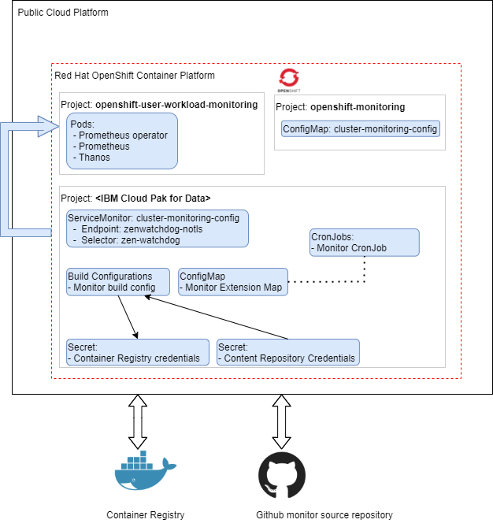

Using the Cloud Pak Deployer,monitors can be deployed which uses the Cloud Pak for Data zen-watchdog monitor framework. 
This allows adding custom monitors to the zen-watchdog, making these custom monitors visible in the Cloud Pak for Data metrics.



Using the Cloud Pak Deployer cp4d_monitors capability implements the following:
- Create Cloud Pak for Data ServiceMonitor endpoint to forward zen-watchdog monitor events to OpenShift Cluster monitoring
- Create source repository auth secrets (optional, if pulling monitors from secure repo)
- Create target container registry auth secrets (optional, if pushing monitor images to secure container registry)
- Deploy custom monitors, which will be added to the zen-watchdog monitor framework

For custom monitors to be deployed, it is mandatory to enable the OpenShift user-workload monitoring, which can be specified using the `openshift_monitoring` configuration element. More information is available [here](/cpd-design/components/monitoring).


Each `cp4d_monitors` entry contains a set of default settings, which are applicable to the `monitors` list. These defaults can be overwritten per monitor if needed.

| Property | Description                                                          | Mandatory | Allowed values |
| -------- | -------------------------------------------------------------------- | --------- | -------------- |
| name  | The name of the monitor set    | Yes       | lowercase RFC 1123 subdomain (1)  |
| cp4d_instance | The OpenShift project (namespace) on which the Cloud Pak for Data instance resides  | Yes       |  |
| openshift_cluster_name | The Openshift cluster name | Yes |  |
| default_monitor_source_repo | The default repository location of all monitors located in the `monitors` section | No |  |
| default_monitor_source_token_secret | The default repo access token secret name, must be available in the vault | No |  |
| default_monitor_target_cr |   The default target container registry (cr) for the monitor image to be pushed. When omitted, the OpenShift internal registry is used | No |  |
| default_monitor_target_cr_user_secret | The default target container registry user name secret name used to push the monitor image. Must be available in the vault | No |  |
| default_monitor_target_cr_password_secret | The default target container registry password secret name used to push the monitor image. Must be available in the vault | No |  |
| monitors | List of monitors | Yes |  |

Per `monitors` entry, the following settings are specified:

| Property | Description                                                          | Mandatory | Allowed values |
| -------- | -------------------------------------------------------------------- | --------- | -------------- |
| name  | The name of the monitor entry     | Yes       | lowercase RFC 1123 subdomain (1)   |
| monitor_source_repo | Overrides default_monitor_source_repo for this single monitor | No | | 
| monitor_source_token_secret | Overrides default_monitor_source_token_secret for this single monitor | No | | 
| monitor_target_cr | Overrides default_monitor_target_cr for this single monitor | No | | 
| monitor_target_cr_user_secret | Overrides default_monitor_target_cr_user_secret for this single monitor | No | | 
| monitor_target_cr_user_password | Overrides default_monitor_target_cr_user_password for this single monitor | No | | 
| context | Sets the context of the monitor the the source repo (sub folder name) | Yes | | 
| label | Set the label of the pushed image, default to 'latest' | No | | 
| schedule | Sets the schedule of the generated Cloud Pak for Data monitor cronjob | Yes | | 

Each monitor has a set of `event_types`, which contain the observations generated by the monitor. These event types are retrieved directly from the github repository, which it is expected that each `context` contains a file called `event_types.yml`. During deployment of the monitor this file is retrieved and used to populate the `event_types` of the monitor. 

If the Deployer runs and the monitor is already deployed, the following process is used:
- The build process is restarted to ensure the latest image of monitor is used
- A comparison is made between the monitor's current configuration and the configuration created by the Deployer. If these are identical, the monitor's configuration is left as-is, however if these are different, the monitor's configuration is rebuild and the monitor is re-deployed. 

File: config/cp4d_monitors.yaml

```
---
#Enable OpenShift user-workload monitoring
openshift_monitoring:
- openshift_cluster_name: pluto-01
  user_workload: enabled
  remote_rewrite_url: http://www.example.com:1234/receive
  retention_period: 15d
  pvc_storage_class: ibmc-vpc-block-retain-general-purpose
  pvc_storage_size_gb: 100
  grafana_operator: enabled
  grafana_project: grafana

# List of cp4d_monitors
cp4d_monitors:
- name: cp4d-monitor-set-1
  cp4d_instance: zen-45
  openshift_cluster_name: pluto-01
  default_monitor_source_repo: https://github.com/IBM/cp4d-monitors
  #default_monitor_source_token_secret: monitors_source_repo_secret
  #default_monitor_target_cr: de.icr.io/monitorrepo  
  #default_monitor_target_cr_user_secret: monitors_target_cr_username
  #default_monitor_target_cr_password_secret: monitors_target_cr_password
  # List of monitors
  monitors:
  - name: cp4d-cognos-task-info
    context: cp4d-cognos-task-info
    label: latest
    schedule: "*/15 * * * *"
  - name: cp4d-platform-global-connections
    context: cp4d-platform-global-connections
    label: latest
    schedule: "*/15 * * * *"
  - name: cp4d-watsonstudio-job-info-monitor
    context: cp4d-watsonstudio-job-info
    label: latest
    schedule: "*/15 * * * *"
  - name: cp4d-platform-watsonstudio-schedule-job-info
    context: cp4d-watsonstudio-job-schedule-info
    label: latest
    schedule: "*/15 * * * *"
  - name: cp4d-platform-watsonstudio-runtime-usage
    context: cp4d-watsonstudio-runtime-usage
    label: latest
    schedule: "*/15 * * * *"
  - name: cp4d-wkc-info
    context: cp4d-wkc-info
    label: latest
    schedule: "*/15 * * * *"
  - name: cp4d-platform-wml-deployment-space-info
    context: cp4d-wml-deployment-space-info
    label: latest  
    schedule: "*/15 * * * *"
  - name: cp4d-platform-wml-deployment-space-job-info
    context: cp4d-wml-deployment-space-job-info
    label: latest
    schedule: "*/15 * * * *"
```