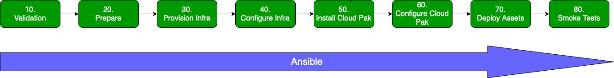

# Deployment process overview

When running the Cloud Pak Deployer (`cp-deploy env apply`), a series of pre-defined stages are followed to arrive at the desired end-state.

## [10 - Validation](/cpd-design/process/validate)
In this stage, the following activities are executed:
* Is the specified cloud platform in the inventory file supported?
* Are the mandatory variables defined?
* Can the deployer connect to the specified vault?

## [20 - Prepare](/cpd-design/process/prepare)
In this stage, the following activities are executed:
* Read the configuration files from the `config` directory
* Replace variable placeholders in the configuration with the extra parameters passed to the `cp-deploy` command
* Expand the configuration with defaults from the `defaults` directory
* Run the "linter" to check the object attributes in the configuration and their relations
* Generate the Terraform scripts to provision the infrastructure (IBM Cloud only)

## [30 - Provision infra](/cpd-design/process/provision-infra)
In this stage, the following activities are executed:
* Run Terraform to create or change the infrastructure components (IBM Cloud only)

## [40 - Configure infra](/cpd-design/process/configure-infra)
In this stage, the following activities are executed:
* Configure the VPC bastion server(s) (IBM Cloud only)
* Configure the VPC NFS server(s) (IBM Cloud only)
* Configure the OpenShift storage classes, both NFS and OCS (IBM Cloud only)

## [50 - Install Cloud Pak](/cpd-design/process/install-cloud-pak)
In this stage, the following activities are executed:
* Create the IBM Container Registry namespace if specified (IBM Cloud only)
* Connect to the specified image registry if specified
* Prepare OpenShift cluster for Cloud Pak for Data installation
* Mirror images to the private registry, if specified
* Install Cloud Pak for Data control plane
* Install specified Cloud Pak for Data cartridges
* Configure LDAP authentication for Cloud Pak for Data, if specified

## [60 - Configure Cloud Pak](/cpd-design/process/configure-cloud-pak)
In this stage, the following activities are executed:
* Configure instance for the cartridges, if specified (Db2, Cognos Analytics, Data Virtualization, ...)
* Configure instance authorization using the LDAP group mapping

## [70 - Deploy Assets](/cpd-design/process/deploy-assets)
Nothing has been implemented yet for this stage.

## [80 - Smoke Tests](/cpd-design/process/smoke-tests)
In this stage, the following activities are executed:
* Show the Cloud Pak for Data URL and admin password