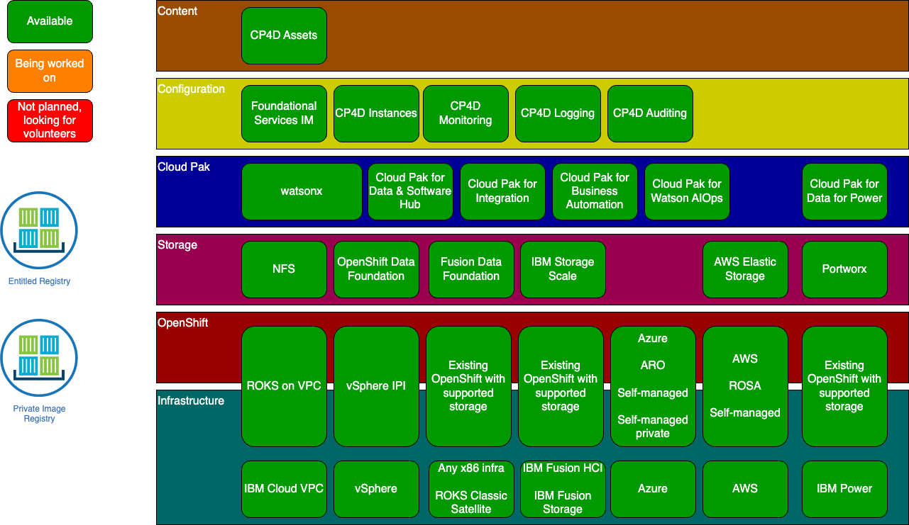

# Current state of the Cloud Pak Deployer
The below picture indicates the current state of the Cloud Pak Deployer, which infrastructures are supported to provision or use OpenShift, the storage classes which can be controlled and the Cloud Paks with cartridges and components.

# Support statement
Cloud Pak Deployer has proven to be a useful tool to install OpenShift, the IBM Cloud Paks and watsonx through a unified and unattended installation script. It has been used by many IBM field specialists, IBM business partners, clients and even several development teams are using the tools. A question that often comes up: "Is Cloud Pak Deployer supported by IBM Support". The answer is **NO**. for the tool itself, similar to any bash, Python, Ansible, Chef, Terraform, CI/CD pipelines, or other scripts that would be developed by IBM Expert Labs, business partners or clients. 

However, the IBM products which are deployed using the tool can continue to be supported, given that the steps executed for the installation correspond with the official product documentation. For example, the installation of Cloud Pak for Data and watsonx and its services are done through the `apply-olm` and `apply-cr` subcommands which are part of `cpd-cli manage`.

To create better insights into which steps have been executed for the installation of the products, Cloud Pak Deployer now generates a log file `$STATUS_DIR/log/deployer-activities.log`, which logs all the steps and which can be used to reproduce an installation using the standard `cpd-cli` and `oc` commands found in the documentation. Activity logging has currently been implemented only for Existing OpenShift installations of Cloud Pak for Data and watsonx. Other Cloud Paks will follow.

Additionally, you can use Cloud Pak Deployer to generate an activity log only using the `--dry-run` command-line option, run as an OpenShift user with `cluster-reader` role. This will be convenient if you do not want to let deployer do the installation but generate the steps you can then execute manually or through a script.

For the "general" support statement, check the [Apache license](https://github.com/IBM/cloud-pak-deployer?tab=Apache-2.0-1-ov-file#readme) which is referenced in the GitHub repository.