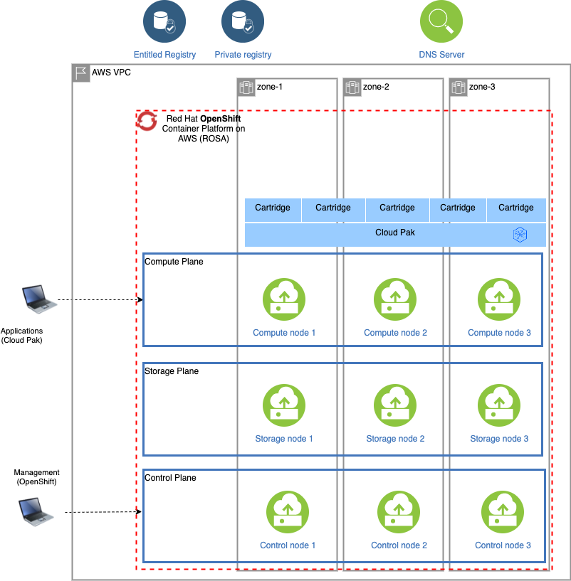

# Running the Cloud Pak Deployer on AWS (Self-managed)

On Amazon Web Services (AWS), OpenShift can be set up in various ways, self-managed or managed by Red Hat (ROSA). The steps below are applicable to a self-managed OpenShift installation. The IPI (Installer Provisioned Infrastructure) installer will be used. More information about IPI installation can be found here: https://docs.openshift.com/container-platform/4.12/installing/installing_aws/installing-aws-customizations.html.

There are 5 main steps to run the deploye for AWS:

1. [Configure deployer](#1-configure-deployer)
2. [Prepare the cloud environment](#2-prepare-the-cloud-environment)
3. [Obtain entitlement keys and secrets](#3-acquire-entitlement-keys-and-secrets)
4. [Set environment variables and secrets](#4-set-environment-variables-and-secrets)
5. [Run the deployer](#5-run-the-deployer)
6. [Post-install configuration (Add GPU nodes)](#6-post-install-configuration)

See the deployer in action in this video:

<video src="https://ibm.box.com/shared/static/01jbnh1racivtjjmwnc10fxj9xr2uhgp.mp4" controls="controls" muted="muted" class="d-block rounded-bottom-2 border-top width-fit" style="max-height:300px; min-height: 200px"></video>

## Topology

A typical setup of the self-managed OpenShift cluster is pictured below:


### Single-node OpenShift (SNO) on AWS
Red Hat OpenShift also supports single-node deployments in which control plane and compute are combined into a single node. Obviously, this type of configuration does not cater for any high availability requirements that are usually part of a production installation, but it does offer a more cost-efficient option for development and testing purposes.

Cloud Pak Deployer can deploy a single-node OpenShift with elastic storage and a sample configuration is provided as part of the deployer.

!!! warning
    When deploying the IBM Cloud Paks on single-node OpenShift, there may be intermittent timeouts as pods are starting up. In those cases, just re-run the deployer with the same configuration and check status of the pods.

## 1. Configure deployer

### Deployer configuration and status directories
Deployer reads the configuration from a directory you set in the `CONFIG_DIR` environment variable. A status directory (`STATUS_DIR` environment variable) is used to log activities, store temporary files, scripts. If you use a File Vault (default), the secrets are kept in the `$STATUS_DIR/vault` directory.

You can find OpenShift and Cloud Pak sample configuration (yaml) files here: [sample configuration](https://github.com/IBM/cloud-pak-deployer/tree/main/sample-configurations/sample-dynamic/config-samples). For self-managed OpenShift installations, copy one of `ocp-aws-self-managed-*.yaml` files into the `$CONFIG_DIR/config` directory. If you also want to install a Cloud Pak, copy one of the `cp4*.yaml` files.

Example:
``` { .bash .copy }
mkdir -p $HOME/cpd-config/config
cp sample-configurations/sample-dynamic/config-samples/ocp-aws-self-managed-elastic.yaml $HOME/cpd-config/config/
cp sample-configurations/sample-dynamic/config-samples/cp4d-471.yaml $HOME/cpd-config/config/
```

### Set configuration and status directories environment variables
Cloud Pak Deployer uses the status directory to log its activities and also to keep track of its running state. For a given environment you're provisioning or destroying, you should always specify the same status directory to avoid contention between different deploy runs. 

``` { .bash .copy }
export CONFIG_DIR=$HOME/cpd-config
export STATUS_DIR=$HOME/cpd-status
```

- `CONFIG_DIR`: Directory that holds the configuration, it must have a `config` subdirectory which contains the configuration `yaml` files.
- `STATUS_DIR`: The directory where the Cloud Pak Deployer keeps all status information and logs files.

#### Optional: advanced configuration
If the deployer configuration is kept on GitHub, follow the instructions in [GitHub configuration](../../50-advanced/advanced-configuration.md#using-a-github-repository-for-the-configuration).

For special configuration with defaults and dynamic variables, refer to [Advanced configuration](../../50-advanced/advanced-configuration.md#using-dynamic-variables-extra-variables).

## 2. Prepare the cloud environment

### Configure Route53 service on AWS

When deploying a self-managed OpenShift on Amazon web Services, a public hosted zone must be created in the same account as your OpenShift cluster. The domain name or subdomain name registered in the Route53 service must be specifed in the `openshift` configuration of the deployer. 

For more information on acquiring or specifying a domain on AWS, you can refer to https://github.com/openshift/installer/blob/master/docs/user/aws/route53.md.

### Obtain the AWS IAM credentials

If you can use your permanent security credentials for the AWS account, you will need an **Access Key ID** and **Secret Access Key** for the deployer to setup an OpenShift cluster on AWS. 

- Go to https://aws.amazon.com/
- Login to the AWS console
- Click on your user name at the top right of the screen
- Select **Security credentials**. You can also reach this screen via https://console.aws.amazon.com/iam/home?region=us-east-2#/security_credentials.
- If you do not yet have an access key (or you no longer have the associated secret), create an access key
- Store your **Access Key ID** and **Secret Access Key** in safe place

### Alternative: Using temporary AWS security credentials (STS)

If your account uses temporary security credentials for AWS resources, you must use the **Access Key ID**, **Secret Access Key** and **Session Token** associated with your temporary credentials. 

For more information about using temporary security credentials, see https://docs.aws.amazon.com/IAM/latest/UserGuide/id_credentials_temp_use-resources.html.

The temporary credentials must be issued for an IAM role that has sufficient permissions to provision the infrastructure and all other components. More information about required permissions can be found here: https://docs.openshift.com/container-platform/4.10/authentication/managing_cloud_provider_credentials/cco-mode-sts.html#sts-mode-create-aws-resources-ccoctl.

An example on how to retrieve the temporary credentials for a user-defined role:
``` { .bash .copy }
printf "\nexport AWS_ACCESS_KEY_ID=%s\nexport AWS_SECRET_ACCESS_KEY=%s\nexport AWS_SESSION_TOKEN=%s\n" $(aws sts assume-role \
--role-arn arn:aws:iam::678256850452:role/ocp-sts-role \
--role-session-name OCPInstall \
--query "Credentials.[AccessKeyId,SecretAccessKey,SessionToken]" \
--output text)
```

Thie would return something like the below, which you can then paste into the session running the deployer.
```output
export AWS_ACCESS_KEY_ID=ASIxxxxxxAW
export AWS_SECRET_ACCESS_KEY=jtLxxxxxxxxxxxxxxxGQ
export AWS_SESSION_TOKEN=IQxxxxxxxxxxxxxbfQ
```

If the `openshift` configuration has the `infrastructure.credentials_mode` set to `Manual`, Cloud Pak Deployer will automatically configure and run the Cloud Credential Operator utility.

## 3. Acquire entitlement keys and secrets

### Acquire IBM Cloud Pak entitlement key

If you want to pull the Cloud Pak images from the entitled registry (i.e. an online install), or if you want to mirror the images to your private registry, you need to download the entitlement key. You can skip this step if you're installing from a private registry and all Cloud Pak images have already been downloaded to the private registry.

- Navigate to https://myibm.ibm.com/products-services/containerlibrary and login with your IBMId credentials
- Select **Get Entitlement Key** and create a new key (or copy your existing key)
- Copy the key value

!!! warning
    As stated for the API key, you can choose to download the entitlement key to a file. However, when we reference the entitlement key, we mean the 80+ character string that is displayed, not the file.

### Acquire an OpenShift pull secret

To install OpenShift you need an OpenShift pull secret which holds your entitlement.

- Navigate to https://console.redhat.com/openshift/install/pull-secret and download the pull secret into file `/tmp/ocp_pullsecret.json`

### Optional: Locate or generate a public SSH Key
To obtain access to the OpenShift nodes post-installation, you will need to specify the public SSH key of your server; typically this is `~/.ssh/id_rsa.pub`, where `~` is the home directory of your user. If you don't have an SSH key-pair yet, you can generate one using the steps documented here: https://cloud.ibm.com/docs/ssh-keys?topic=ssh-keys-generating-and-using-ssh-keys-for-remote-host-authentication#generating-ssh-keys-on-linux. Alternatively, deployer can generate SSH key-pair automatically if credential `ocp-ssh-pub-key` is not in the vault.

## 4. Set environment variables and secrets

### Set the Cloud Pak entitlement key
If you want the Cloud Pak images to be pulled from the entitled registry, set the Cloud Pak entitlement key.

``` { .bash .copy }
export CP_ENTITLEMENT_KEY=your_cp_entitlement_key
```

- `CP_ENTITLEMENT_KEY`: This is the entitlement key you acquired as per the instructions above, this is a 80+ character string. **You don't need to set this environment variable when you install the Cloud Pak(s) from a private registry**

### Set the environment variables for AWS self-managed OpenShift deployment
``` { .bash .copy }
export AWS_ACCESS_KEY_ID=your_access_key
export AWS_SECRET_ACCESS_KEY=your_secret_access_key
```

Optional: If your user does not have permanent administrator access but using temporary credentials, you can set the `AWS_SESSION_TOKEN` to be used for the AWS CLI.
``` { .bash .copy }
export AWS_SESSION_TOKEN=your_session_token
```

- `AWS_ACCESS_KEY_ID`: This is the AWS Access Key you retrieved above, often this is something like `AK1A2VLMPQWBJJQGD6GV`
- `AWS_SECRET_ACCESS_KEY`: The secret associated with your AWS Access Key, also retrieved above
- `AWS_SESSION_TOKEN`: The session token that will grant temporary elevated permissions

!!! warning
    If your `AWS_SESSION_TOKEN` is expires while the deployer is still running, the deployer may end abnormally. In such case, you can just issue new temporary credentials (`AWS_ACCESS_KEY_ID`, `AWS_SECRET_ACCESS_KEY` and `AWS_SESSION_TOKEN`) and restart the deployer. Alternatively, you can update the 3 vault secrets, respectively `aws-access-key`, `aws-secret-access-key` and `aws-session-token` with new values as they are re-retrieved by the deployer on a regular basis.

### Create the secrets needed for self-managed OpenShift cluster

You need to store the below credentials in the vault so that the deployer has access to them when installing self-managed OpenShift cluster on AWS.

``` { .bash .copy }
cp-deploy.sh vault set \
    --vault-secret ocp-pullsecret \
    --vault-secret-file /tmp/ocp_pullsecret.json
```

### Optional: Create secret for public SSH key

If you want to use your SSH key to access nodes in the cluster, set the Vault secret with the public SSH key.
``` { .bash .copy }
cp-deploy.sh vault set \
    --vault-secret ocp-ssh-pub-key \
    --vault-secret-file ~/.ssh/id_rsa.pub
```

### Optional: Set the GitHub Personal Access Token (PAT)
In some cases, download of the `cloudctl` and `cpd-cli` clients from https://github.com/IBM will fail because GitHub limits the number of API calls from non-authenticated clients. You can remediate this issue by creating a [Personal Access Token on github.com](https://github.com/settings/tokens) and creating a secret in the vault.

``` { .bash .copy }
cp-deploy.sh vault set -vs github-ibm-pat=<your PAT>
```

Alternatively, you can set the secret by adding `-vs github-ibm-pat=<your PAT>` to the `cp-deploy.sh env apply` command.

## 5. Run the deployer

### Set path and alias for the deployer

``` { .bash .copy }
source ./set-env.sh
```

### Optional: validate the configuration

If you only want to validate the configuration, you can run the dpeloyer with the `--check-only` argument. This will run the first stage to validate variables and vault secrets and then execute the generators.

``` { .bash .copy }
cp-deploy.sh env apply --check-only --accept-all-licenses
```

### Run the Cloud Pak Deployer

To run the container using a local configuration input directory and a data directory where temporary and state is kept, use the example below. If you don't specify the status directory, the deployer will automatically create a temporary directory. Please note that the status directory will also hold secrets if you have configured a flat file vault. If you lose the directory, you will not be able to make changes to the configuration and adjust the deployment. It is best to specify a permanent directory that you can reuse later. If you specify an existing directory the current user **must** be the owner of the directory. Failing to do so may cause the container to fail with insufficient permissions.

``` { .bash .copy }
cp-deploy.sh env apply --accept-all-licenses
```

You can also specify extra variables such as `env_id` to override the names of the objects referenced in the `.yaml` configuration files as `{{ env_id }}-xxxx`. For more information about the extra (dynamic) variables, see [advanced configuration](../../../50-advanced/advanced-configuration).

The `--accept-all-licenses` flag is optional and confirms that you accept all licenses of the installed cartridges and instances. Licenses must be either accepted in the configuration files or at the command line.

When running the command, the container will start as a daemon and the command will tail-follow the logs. You can press Ctrl-C at any time to interrupt the logging but the container will continue to run in the background.

You can return to view the logs as follows:

``` { .bash .copy }
cp-deploy.sh env logs
```

Deploying the infrastructure, preparing OpenShift and installing the Cloud Pak will take a long time, typically between 1-5 hours,dependent on which Cloud Pak cartridges you configured. For estimated duration of the steps, refer to [Timings](../../../30-reference/timings).

If you need to interrupt the automation, use CTRL-C to stop the logging output and then use:

``` { .bash .copy }
cp-deploy.sh env kill
```

### On failure

If the Cloud Pak Deployer fails, for example because certain infrastructure components are temporarily not available, fix the cause if needed and then just re-run it with the same `CONFIG_DIR` and `STATUS_DIR` as well extra variables. The provisioning process has been designed to be idempotent and it will not redo actions that have already completed successfully.

### Finishing up

Once the process has finished, it will output the URLs by which you can access the deployed Cloud Pak. You can also find this information under the `cloud-paks` directory in the status directory you specified.

To retrieve the Cloud Pak URL(s):

``` { .bash .copy }
cat $STATUS_DIR/cloud-paks/*
```

This will show the Cloud Pak URLs:

```output
Cloud Pak for Data URL for cluster pluto-01 and project cpd (domain name specified was example.com):
https://cpd-cpd.apps.pluto-01.example.com
```

The `admin` password can be retrieved from the vault as follows:

List the secrets in the vault:

``` { .bash .copy }
cp-deploy.sh vault list
```

This will show something similar to the following:

```output
Secret list for group sample:
- aws-access-key
- aws-secret-access-key
- ocp-pullsecret
- ocp-ssh-pub-key
- ibm_cp_entitlement_key
- pluto-01-cluster-admin-password
- cp4d_admin_zen_40_pluto_01
- all-config
```

You can then retrieve the Cloud Pak for Data admin password like this:

``` { .bash .copy }
cp-deploy.sh vault get --vault-secret cp4d_admin_zen_40_pluto_01
```

```output
PLAY [Secrets] *****************************************************************
included: /cloud-pak-deployer/automation-roles/99-generic/vault/vault-get-secret/tasks/get-secret-file.yml for localhost
cp4d_admin_zen_40_pluto_01: gelGKrcgaLatBsnAdMEbmLwGr
```

## 6. Post-install configuration
You can find examples of a couple of typical changes you may want to do here: [Post-run changes](../../../10-use-deployer/5-post-run/post-run):

* Update the Cloud Pak for Data administrator password
* Add GPU node(s) to your OpenShift cluster