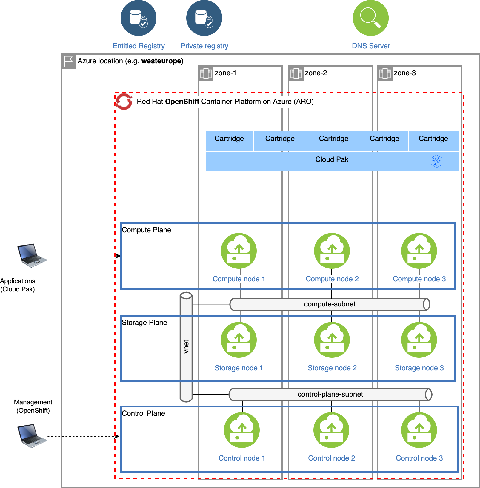

# Running the Cloud Pak Deployer on Microsoft Azure - ARO

On Azure, OpenShift can be set up in various ways, managed by Red Hat (ARO) or self-managed. The steps below are applicable to the ARO (Azure Red Hat OpenShift).

There are 5 main steps to run the deployer for Azure:

1. [Configure deployer](#1-configure-deployer)
2. [Prepare the cloud environment](#2-prepare-the-cloud-environment)
3. [Obtain entitlement keys and secrets](#3-acquire-entitlement-keys-and-secrets)
4. [Set environment variables and secrets](#4-set-environment-variables-and-secrets)
5. [Run the deployer](#5-run-the-deployer)

## Topology

A typical setup of the ARO cluster is pictured below:


When deploying ARO, you can configure the domain name by setting the `openshift.domain_name` attribute. The resulting domain name is managed by Azure, and it must be unique across all ARO instances deployed in Azure. Both the API and Ingress urls are set to be public in the template, so they can be resolved by external clients. If you want to use a custom domain and don't have one yet, you buy one from Azure: https://learn.microsoft.com/en-us/azure/app-service/manage-custom-dns-buy-domain.

## 1. Configure deployer

### Deployer configuration and status directories
Deployer reads the configuration from a directory you set in the `CONFIG_DIR` environment variable. A status directory (`STATUS_DIR` environment variable) is used to log activities, store temporary files, scripts. If you use a File Vault (default), the secrets are kept in the `$STATUS_DIR/vault` directory.

You can find OpenShift and Cloud Pak sample configuration (yaml) files here: [sample configuration](https://github.com/IBM/cloud-pak-deployer/tree/main/sample-configurations/sample-dynamic/config-samples). For ARO installations, copy one of `ocp-azure-aro*.yaml` files into the `$CONFIG_DIR/config` directory. If you also want to install a Cloud Pak, copy one of the `cp4*.yaml` files.

Example:
```
mkdir -p $HOME/cpd-config/config
cp sample-configurations/sample-dynamic/config-samples/ocp-azure-aro.yaml $HOME/cpd-config/config/
cp sample-configurations/sample-dynamic/config-samples/cp4d-471.yaml $HOME/cpd-config/config/
```

### Set configuration and status directories environment variables
Cloud Pak Deployer uses the status directory to log its activities and also to keep track of its running state. For a given environment you're provisioning or destroying, you should always specify the same status directory to avoid contention between different deploy runs. 

```
export CONFIG_DIR=$HOME/cpd-config
export STATUS_DIR=$HOME/cpd-status
```

- `CONFIG_DIR`: Directory that holds the configuration, it must have a `config` subdirectory which contains the configuration `yaml` files.
- `STATUS_DIR`: The directory where the Cloud Pak Deployer keeps all status information and logs files.

#### Optional: advanced configuration
If the deployer configuration is kept on GitHub, follow the instructions in [GitHub configuration](../../50-advanced/advanced-configuration.md#using-a-github-repository-for-the-configuration).

For special configuration with defaults and dynamic variables, refer to [Advanced configuration](../../50-advanced/advanced-configuration.md#using-dynamic-variables-extra-variables).

## 2. Prepare the cloud environment

### Install the Azure CLI tool

[Install Azure CLI tool](https://learn.microsoft.com/en-us/cli/azure/install-azure-cli-linux?pivots=dnf), and run the commands in your operating system.

### Verify your quota and permissions in Microsoft Azure

- Check [Azure resource quota](https://docs.microsoft.com/en-us/azure/openshift/tutorial-create-cluster#before-you-begin) of the subscription - Azure Red Hat OpenShift requires a minimum of 40 cores to create and run an OpenShift cluster.
- The ARO cluster is provisioned using the `az` command. Ideally, one has to have `Contributor` permissions on the subscription (Azure resources) and `Application administrator` role assigned in the Azure Active Directory. See details [here](https://docs.microsoft.com/en-us/azure/openshift/tutorial-create-cluster#verify-your-permissions).

#### Set environment variables for Azure

```bash
export AZURE_RESOURCE_GROUP=pluto-01-rg
export AZURE_LOCATION=westeurope
export AZURE_SP=pluto-01-sp
```

- `AZURE_RESOURCE_GROUP`: The Azure resource group that will hold all resources belonging to the cluster: VMs, load balancers, virtual networks, subnets, etc.. Typically you will create a resource group for every OpenShift cluster you provision.
- `AZURE_LOCATION`: The Azure location of the resource group, for example `useast` or `westeurope`.
- `AZURE_SP`: Azure service principal that is used to create the resources on Azure. You will get the service principal from the Azure administrator.

### Store Service Principal credentials

You must run the OpenShift installation using an Azure Service Principal with sufficient permissions. The Azure account administrator will share the SP credentials as a JSON file. If you have subscription-level access you can also create the Service Principal yourself. See steps in [Create Azure service principal](./azure-service-principal.md).


Example output in credentials file:
```output
{
  "appId": "a4c39ae9-f9d1-4038-b4a4-ab011e769111",
  "displayName": "pluto-01-sp",
  "password": "xyz-xyz",
  "tenant": "869930ac-17ee-4dda-bbad-7354c3e7629c8"
}
```

Store this file as `/tmp/${AZURE_SP}-credentials.json`.

### Login as Service Principal

Login as the service principal:
```
az login --service-principal -u a4c39ae9-f9d1-4038-b4a4-ab011e769111 -p xyz-xyz --tenant 869930ac-17ee-4dda-bbad-7354c3e7629c8
```

### Register Resource Providers

Make sure the following Resource Providers are registered for your subscription by running:

```bash
az provider register -n Microsoft.RedHatOpenShift --wait
az provider register -n Microsoft.Compute --wait
az provider register -n Microsoft.Storage --wait
az provider register -n Microsoft.Authorization --wait
```

### Create the resource group

First the resource group must be created; this resource group must match the one configured in your OpenShift yaml config file.
```bash
az group create \
  --name ${AZURE_RESOURCE_GROUP} \
  --location ${AZURE_LOCATION}
```

## 3. Acquire entitlement keys and secrets

If you want to pull the Cloud Pak images from the entitled registry (i.e. an online install), or if you want to mirror the images to your private registry, you need to download the entitlement key. You can skip this step if you're installing from a private registry and all Cloud Pak images have already been downloaded to the private registry.

- Navigate to https://myibm.ibm.com/products-services/containerlibrary and login with your IBMId credentials
- Select **Get Entitlement Key** and create a new key (or copy your existing key)
- Copy the key value

!!! warning
    As stated for the API key, you can choose to download the entitlement key to a file. However, when we reference the entitlement key, we mean the 80+ character string that is displayed, not the file.

### Acquire an OpenShift pull secret

To install OpenShift you need an OpenShift pull secret which holds your entitlement.

- Navigate to https://console.redhat.com/openshift/install/pull-secret and download the pull secret into file `/tmp/ocp_pullsecret.json`

## 4. Set environment variables and secrets

#### Create the secrets needed for ARO deployment

You need to store the OpenShift pull secret and service principal credentials in the vault so that the deployer has access to it.

```
./cp-deploy.sh vault set \
    --vault-secret ocp-pullsecret \
    --vault-secret-file /tmp/ocp_pullsecret.json


./cp-deploy.sh vault set \
    --vault-secret ${AZURE_SP}-credentials \
    --vault-secret-file /tmp/${AZURE_SP}-credentials.json
```

### Optional: Set the GitHub Personal Access Token (PAT)
In some cases, download of the `cloudctl` and `cpd-cli` clients from https://github.com/IBM will fail because GitHub limits the number of API calls from non-authenticated clients. You can remediate this issue by creating a [Personal Access Token on github.com](https://github.com/settings/tokens) and creating a secret in the vault.

```
./cp-deploy.sh vault set -vs github-ibm-pat=<your PAT>
```

Alternatively, you can set the secret by adding `-vs github-ibm-pat=<your PAT>` to the `./cp-deploy.sh env apply` command.


## 5. Run the deployer  

### Optional: validate the configuration

If you only want to validate the configuration, you can run the dpeloyer with the `--check-only` argument. This will run the first stage to validate variables and vault secrets and then execute the generators.

```
./cp-deploy.sh env apply --check-only --accept-all-licenses
```

### Run the Cloud Pak Deployer

To run the container using a local configuration input directory and a data directory where temporary and state is kept, use the example below. If you don't specify the status directory, the deployer will automatically create a temporary directory. Please note that the status directory will also hold secrets if you have configured a flat file vault. If you lose the directory, you will not be able to make changes to the configuration and adjust the deployment. It is best to specify a permanent directory that you can reuse later. If you specify an existing directory the current user **must** be the owner of the directory. Failing to do so may cause the container to fail with insufficient permissions.

```
./cp-deploy.sh env apply --accept-all-licenses
```

You can also specify extra variables such as `env_id` to override the names of the objects referenced in the `.yaml` configuration files as `{{ env_id }}-xxxx`. For more information about the extra (dynamic) variables, see [advanced configuration](../../../50-advanced/advanced-configuration).

The `--accept-all-licenses` flag is optional and confirms that you accept all licenses of the installed cartridges and instances. Licenses must be either accepted in the configuration files or at the command line.

When running the command, the container will start as a daemon and the command will tail-follow the logs. You can press Ctrl-C at any time to interrupt the logging but the container will continue to run in the background.

You can return to view the logs as follows:

```
./cp-deploy.sh env logs
```

Deploying the infrastructure, preparing OpenShift and installing the Cloud Pak will take a long time, typically between 1-5 hours,dependent on which Cloud Pak cartridges you configured. For estimated duration of the steps, refer to [Timings](../../../30-reference/timings).

If you need to interrupt the automation, use CTRL-C to stop the logging output and then use:

```
./cp-deploy.sh env kill
```

### On failure

If the Cloud Pak Deployer fails, for example because certain infrastructure components are temporarily not available, fix the cause if needed and then just re-run it with the same `CONFIG_DIR` and `STATUS_DIR` as well extra variables. The provisioning process has been designed to be idempotent and it will not redo actions that have already completed successfully.

### Finishing up

Once the process has finished, it will output the URLs by which you can access the deployed Cloud Pak. You can also find this information under the `cloud-paks` directory in the status directory you specified.

To retrieve the Cloud Pak URL(s):

```
cat $STATUS_DIR/cloud-paks/*
```

This will show the Cloud Pak URLs:

```output
Cloud Pak for Data URL for cluster pluto-01 and project cpd (domain name specified was example.com):
https://cpd-cpd.apps.pluto-01.example.com
```

The `admin` password can be retrieved from the vault as follows:

List the secrets in the vault:

```
./cp-deploy.sh vault list
```

This will show something similar to the following:

```output
Secret list for group sample:
- ibm_cp_entitlement_key
- sample-provision-ssh-key
- sample-provision-ssh-pub-key
- cp4d_admin_zen_sample_sample
```

You can then retrieve the Cloud Pak for Data admin password like this:

```
./cp-deploy.sh vault get --vault-secret cp4d_admin_zen_sample_sample
```

```output
PLAY [Secrets] *****************************************************************
included: /automation_script/automation-roles/99-generic/vault/vault-get-secret/tasks/get-secret-file.yml for localhost
cp4d_admin_zen_sample_sample: gelGKrcgaLatBsnAdMEbmLwGr
```

### Post-install configuration
You can find examples of a couple of typical changes you may want to do here: [Post-run changes](../../../10-use-deployer/5-post-run/post-run).