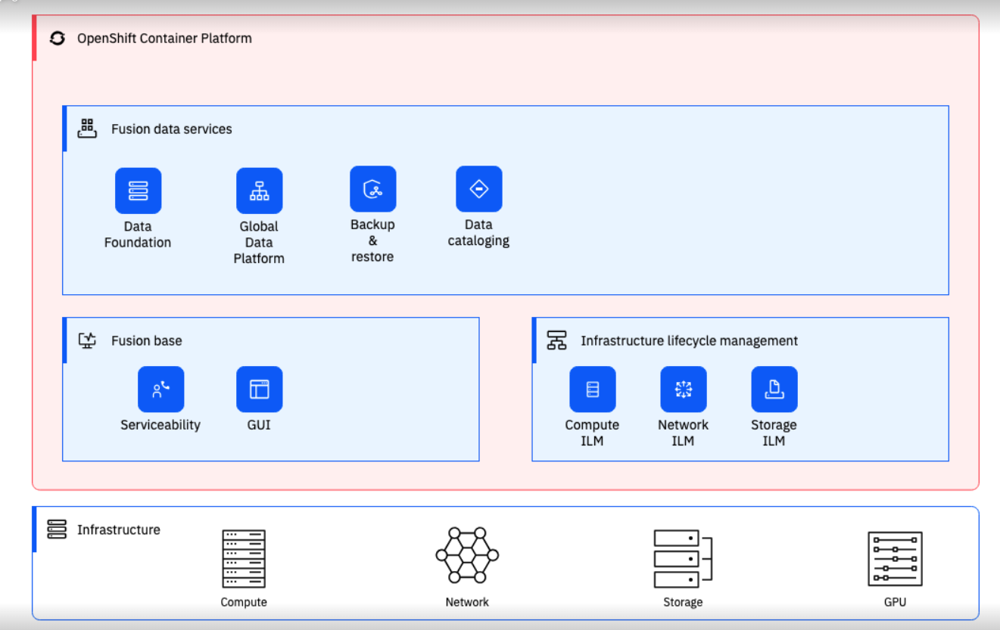

# Running the Cloud Pak Deployer on Fusion SDS and Fusion HCI

This guide provides detailed instructions on using Cloud Pak Deployer on Fusion Software Defined Storage (SDS) and Fusion Hyper-Converged Infrastructure (HCI).

Fusion SDS (Software Defined Storage) is an IBM software offering that provides different storage options for file, block and object storage. The two storage options are: 

* Fusion Data Foundation - this integrates Ceph for block and file storage with rook-ceph for object storage and NooBaa as a gateway to external object storage providers.
* IBM Storage Scale - this is the high-performance clustered file system, formerly known as Spectrum Scale and GPFS.

Fusion HCI (Hyper-Converged Infrastructure) is an IBM offering that combines compute, storage, and networking resources into a single, pre-configured system. It simplifies IT infrastructure management and is optimized for deploying containerized applications. Notably, Fusion HCI integrates OpenShift, a leading container orchestration platform, for streamlined development and deployment.
The stack is very simple : 

- Bare Metal
- RedHat CoreOS
- OpenShift



!!! info

    This guide detail the process of installing Cloud Pak for Data on a Fusion HCI using Storage Scale as the underlying storage solution. Fusion SDS also offers the option to deploy FDF. IBM Storage Scale uses ibm-storage-fusion-cp-sc storage class and is created by default on this environment.


There are 5 main steps to run the deployer for Fusion HCI

1. [Configure deployer](#1-configure-deployer)
2. [Prepare the infrastructure](#2-prepare-the-infrastructure)
3. [Obtain entitlement keys and secrets](#3-acquire-entitlement-keys-and-secrets)
4. [Set environment variables and secrets](#4-set-environment-variables-and-secrets)
5. [Run the deployer](#5-run-the-deployer)

## 1. Configure deployer

### Deployer configuration and status directories
Deployer reads the configuration from a directory you set in the `CONFIG_DIR` environment variable. A status directory (`STATUS_DIR` environment variable) is used to log activities, store temporary files, scripts. If you use a File Vault (default), the secrets are kept in the `$STATUS_DIR/vault` directory.

Discover sample configuration YAML files for OpenShift and Cloud Pak here: [sample configuration](https://github.com/IBM/cloud-pak-deployer/tree/main/sample-configurations/sample-dynamic/config-samples). To set up Fusion HCI, transfer the ocp-fusion-storage-scale.yaml file to the $CONFIG_DIR/config directory. If you're interested in installing watsonx as well, choose one of the watsonx-*.yaml files and copy it accordingly.

Example:
``` { .bash .copy }
mkdir -p $HOME/cpd-config/config
cp sample-configurations/sample-dynamic/config-samples/ocp-fusion-storage-scale.yaml $HOME/cpd-config/config/
cp sample-configurations/sample-dynamic/config-samples/watsonx-480.yaml $HOME/cpd-config/config/
```

!!! attention
    Make sure you review the storage classes in the config files to match your cluster.

### Set configuration and status directories environment variables
Cloud Pak Deployer uses the status directory to log its activities and also to keep track of its running state. For a given environment you're provisioning or destroying, you should always specify the same status directory to avoid contention between different deploy runs. 

``` { .bash .copy }
export CONFIG_DIR=$HOME/cpd-config
export STATUS_DIR=$HOME/cpd-status
```

- `CONFIG_DIR`: Directory that holds the configuration, it must have a `config` subdirectory which contains the configuration `yaml` files.
- `STATUS_DIR`: The directory where the Cloud Pak Deployer keeps all status information and logs files.

#### Optional: advanced configuration
If the deployer configuration is kept on GitHub, follow the instructions in [GitHub configuration](../../50-advanced/advanced-configuration.md#using-a-github-repository-for-the-configuration).

For special configuration with defaults and dynamic variables, refer to [Advanced configuration](../../50-advanced/advanced-configuration.md#using-dynamic-variables-extra-variables).

## 2. Prepare the infrastructure

Fusion HCI/SDS is expected to be configured already with the required storage classes, the user should not require to run any steps in this bullet.

For more information: 
Fusion HCI: https://www.ibm.com/docs/en/fusion-hci-systems
Fusion SDS: https://www.ibm.com/docs/en/fusion-software

## 3. Acquire entitlement keys and secrets

If you want to pull the Cloud Pak images from the entitled registry (i.e. an online install), or if you want to mirror the images to your private registry, you need to download the entitlement key. You can skip this step if you're installing from a private registry and all Cloud Pak images have already been downloaded to the private registry.

- Navigate to https://myibm.ibm.com/products-services/containerlibrary and login with your IBMId credentials
- Select **Get Entitlement Key** and create a new key (or copy your existing key)
- Copy the key value

!!! warning
    As stated for the API key, you can choose to download the entitlement key to a file. However, when we reference the entitlement key, we mean the 80+ character string that is displayed, not the file.


## 4. Set environment variables and secrets

### Set the Cloud Pak entitlement key
If you want the Cloud Pak images to be pulled from the entitled registry, set the Cloud Pak entitlement key.

``` { .bash .copy }
export CP_ENTITLEMENT_KEY=your_cp_entitlement_key
```

- `CP_ENTITLEMENT_KEY`: This is the entitlement key you acquired as per the instructions above, this is a 80+ character string. **You don't need to set this environment variable when you install the Cloud Pak(s) from a private registry**

### Store the OpenShift login command or configuration

Because you will be deploying the Cloud Pak on the Fusion HCI/SDS cluster, the deployer needs to be able to access OpenShift. There are thre methods for passing the login credentials of your OpenShift cluster(s) to the deployer process:

1. [Generic `oc login` command (preferred)](#option-1---generic-oc-login-command)
2. [Specific `oc login` command(s)](#option-2---specific-oc-login-commands)
3. [`kubeconfig` file](#option-3---use-a-kubeconfig-file)

Regardless of which authentication option you choose, the deployer will retrieve the secret from the vault when it requires access to OpenShift. If the secret cannot be found or if it is invalid or the OpenShift login token has expired, the deployer will fail and you will need to update the secret of your choice.

For most OpenShift installations, you can retrieve the `oc login` command with a temporary token from the OpenShift console. Go to the OpenShift console and click on your user at the top right of the page to get the login command. Typically this command looks something like this: `oc login --server=https://api.pluto-01.coc.ibm.com:6443 --token=sha256~NQUUMroU4B6q_GTBAMS18Y3EIba1KHnJ08L2rBHvTHA`

Before passing the `oc login` command or the `kubeconfig` file, make sure you can login to your cluster using the command or the config file. If the cluster's API server has a self-signed certificate, make sure you specify the `--insecure-skip-tls-verify` flag for the `oc login` command.

Example:
``` { .bash .copy }
oc login api.pluto-01.coc.ibm.com:6443 -u kubeadmin -p BmxQ5-KjBFx-FgztG-gpTF3 --insecure-skip-tls-verify
```

Output:
```output
Login successful.

You have access to 65 projects, the list has been suppressed. You can list all projects with 'oc projects'

Using project "default".
```

#### Option 1 - Generic `oc login` command
This is the most straightforward option if you only have 1 OpenShift cluster in your configuration.

Set the environment variable for the `oc login` command
``` { .bash .copy }
export CPD_OC_LOGIN="oc login api.pluto-01.coc.ibm.com:6443 -u kubeadmin -p BmxQ5-KjBFx-FgztG-gpTF3 --insecure-skip-tls-verify"
```

!!! info
    Make sure you put the oc login command between quotes (single or double) to make sure the full command is stored.

When the deployer is run, it automatically sets the `oc-login` vault secret to the specified `oc login` command. When logging in to OpenShift, the deployer first checks if there is a specific `oc login` secret for the cluster in question (see option 2). If there is not, it will default to the generic `oc-login` secret (option 1).

#### Option 2 - Specific `oc login` command(s)
Use this option if you have multiple OpenShift clusters configured in th deployer configuration.

Store the login command in secret `<cluster name>-oc-login`
``` { .bash .copy }
cp-deploy.sh vault set \
  -vs pluto-01-oc-login \
  -vsv "oc login api.pluto-01.coc.ibm.com:6443 -u kubeadmin -p BmxQ5-KjBFx-FgztG-gpTF3 --insecure-skip-tls-verify"
```

!!! info
    Make sure you put the oc login command between quotes (single or double) to make sure the full command is stored.

#### Option 3 - Use a kubeconfig file
If you already have a "kubeconfig" file that holds the credentials of your cluster, you can use this, otherwise:
- Log in to OpenShift as a cluster administrator using your method of choice
- Locate the Kubernetes config file. If you have logged in with the OpenShift client, this is typically `~/.kube/config`

If you did not just login to the cluster, the current context of the kubeconfig file may not point to your cluster. The deployer will check that the server the current context points to matches the `cluster_name` and `domain_name` of the configured `openshift` object. To check the current context, run the following command:
``` { .bash .copy }
oc config current-context
```

Now, store the Kubernetes config file as a vault secret.
``` { .bash .copy }
cp-deploy.sh vault set \
    --vault-secret kubeconfig \
    --vault-secret-file ~/.kube/config
```

If the deployer manages multiple OpenShift clusters, you can specify a kubeconfig file for each of the clusters by prefixing the `kubeconfig` with the name of the `openshift` object, for example:
``` { .bash .copy }
cp-deploy.sh vault set \
    --vault-secret pluto-01-kubeconfig \
    --vault-secret-file /data/pluto-01/kubeconfig

cp-deploy.sh vault set \
    --vault-secret venus-02-kubeconfig \
    --vault-secret-file /data/venus-02/kubeconfig
```
When connecting to the OpenShift cluster, a cluster-specific kubeconfig vault secret will take precedence over the generic `kubeconfig` secret.

## 5. Run the deployer

### Set path and alias for the deployer

``` { .bash .copy }
source ./set-env.sh
```

### Optional: validate the configuration

If you only want to validate the configuration, you can run the dpeloyer with the `--check-only` argument. This will run the first stage to validate variables and vault secrets and then execute the generators.

``` { .bash .copy }
cp-deploy.sh env apply --check-only --accept-all-licenses
```

### Run the Cloud Pak Deployer

To run the container using a local configuration input directory and a data directory where temporary and state is kept, use the example below. If you don't specify the status directory, the deployer will automatically create a temporary directory. Please note that the status directory will also hold secrets if you have configured a flat file vault. If you lose the directory, you will not be able to make changes to the configuration and adjust the deployment. It is best to specify a permanent directory that you can reuse later. If you specify an existing directory the current user **must** be the owner of the directory. Failing to do so may cause the container to fail with insufficient permissions.

``` { .bash .copy }
cp-deploy.sh env apply --accept-all-licenses
```

You can also specify extra variables such as `env_id` to override the names of the objects referenced in the `.yaml` configuration files as `{{ env_id }}-xxxx`. For more information about the extra (dynamic) variables, see [advanced configuration](../../../50-advanced/advanced-configuration).

The `--accept-all-licenses` flag is optional and confirms that you accept all licenses of the installed cartridges and instances. Licenses must be either accepted in the configuration files or at the command line.

When running the command, the container will start as a daemon and the command will tail-follow the logs. You can press Ctrl-C at any time to interrupt the logging but the container will continue to run in the background.

You can return to view the logs as follows:

``` { .bash .copy }
cp-deploy.sh env logs
```

Deploying the infrastructure, preparing OpenShift and installing the Cloud Pak will take a long time, typically between 1-5 hours,dependent on which Cloud Pak cartridges you configured. For estimated duration of the steps, refer to [Timings](../../../30-reference/timings).

If you need to interrupt the automation, use CTRL-C to stop the logging output and then use:

``` { .bash .copy }
cp-deploy.sh env kill
```

### On failure

If the Cloud Pak Deployer fails, for example because certain infrastructure components are temporarily not available, fix the cause if needed and then just re-run it with the same `CONFIG_DIR` and `STATUS_DIR` as well extra variables. The provisioning process has been designed to be idempotent and it will not redo actions that have already completed successfully.

### Finishing up

Once the process has finished, it will output the URLs by which you can access the deployed Cloud Pak. You can also find this information under the `cloud-paks` directory in the status directory you specified.

To retrieve the Cloud Pak URL(s):

``` { .bash .copy }
cat $STATUS_DIR/cloud-paks/*
```

This will show the Cloud Pak URLs:

```output
Cloud Pak for Data URL for cluster pluto-01 and project cpd (domain name specified was example.com):
https://cpd-cpd.apps.pluto-01.example.com
```

The `admin` password can be retrieved from the vault as follows:

List the secrets in the vault:

``` { .bash .copy }
cp-deploy.sh vault list
```

This will show something similar to the following:

```output
Secret list for group sample:
- ibm_cp_entitlement_key
- oc-login
- cp4d_admin_cpd_demo
```

You can then retrieve the Cloud Pak for Data admin password like this:

``` { .bash .copy }
cp-deploy.sh vault get --vault-secret cp4d_admin_cpd_sample
```

```output
PLAY [Secrets] *****************************************************************
included: /cloud-pak-deployer/automation-roles/99-generic/vault/vault-get-secret/tasks/get-secret-file.yml for localhost
cp4d_admin_zen_sample_sample: gelGKrcgaLatBsnAdMEbmLwGr
```

### Post-install configuration
You can find examples of a couple of typical changes you may want to do here: [Post-run changes](../../../10-use-deployer/5-post-run/post-run).