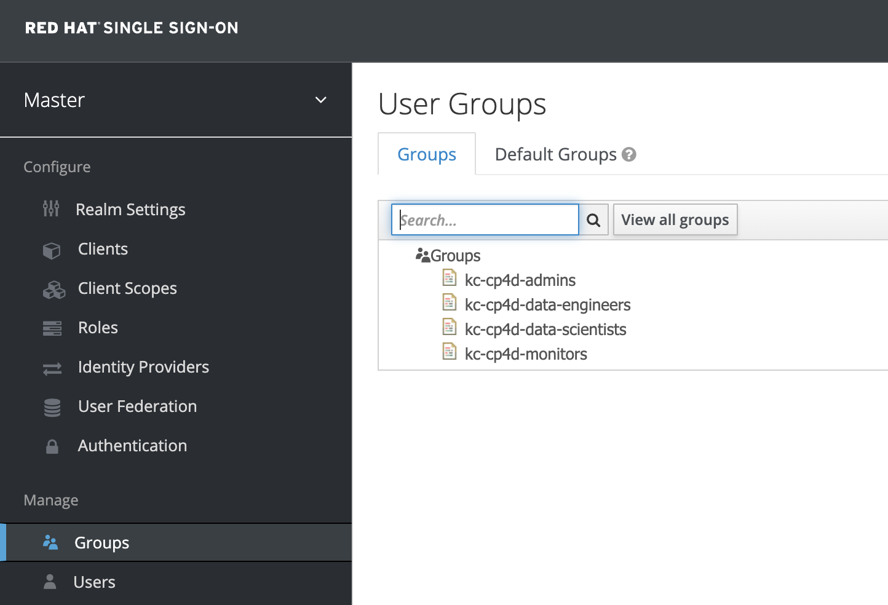
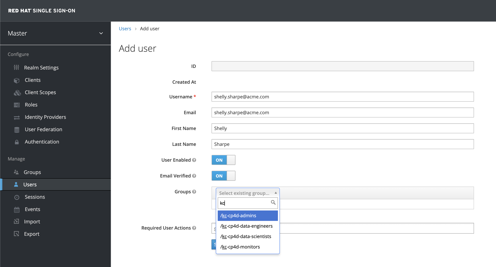
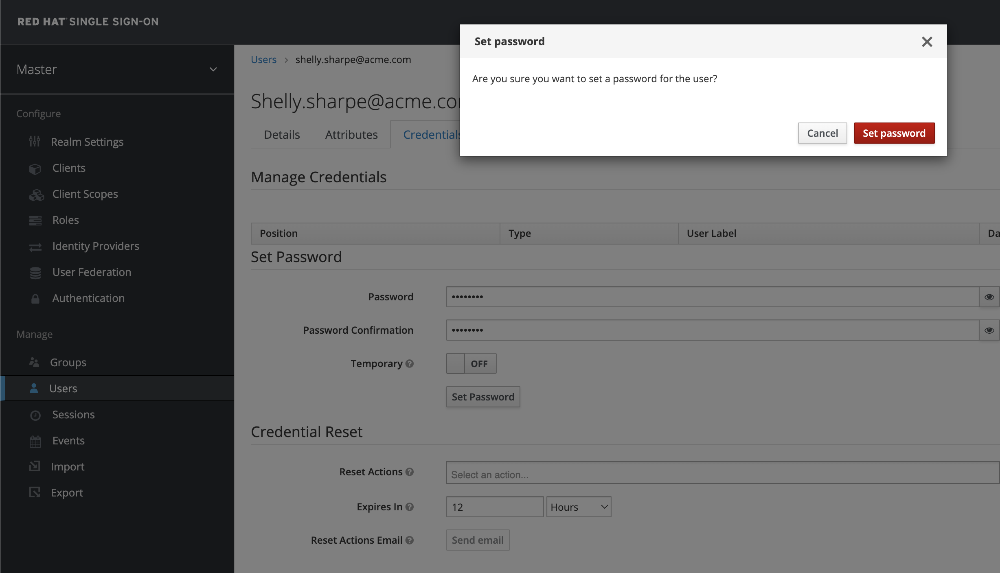
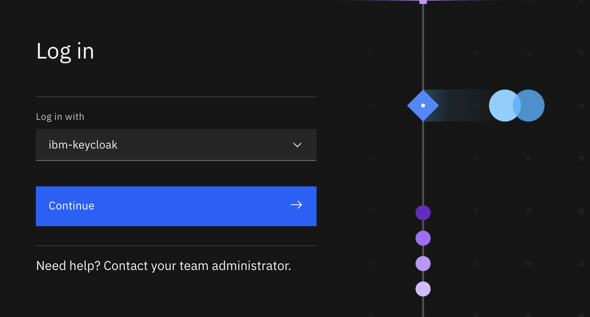
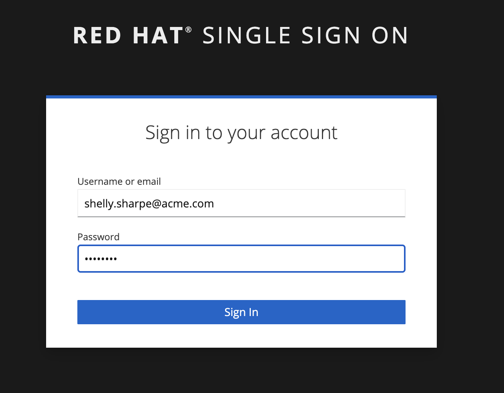
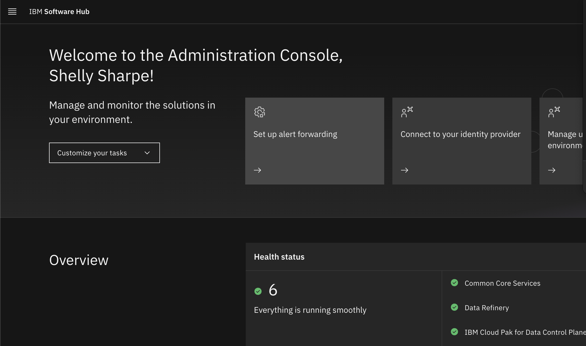

# Adding users to Keycloak to be used in Software Hub (Cloud Pak for Data/watsonx)

When `redhat-sso` is present in your configuration yaml files, the deployer will install Keycloak and create the defined groups and Software Hub. Below are the steps to add users to Keycloak and associate them with the pre-defined groups.

Example configuration:
```
openshift_redhat_sso:
- openshift_cluster_name: "{{ env_id }}"
  keycloak_name: ibm-keycloak
  groups:
  - name: kc-cp4d-admins
    state: present
  - name: kc-cp4d-data-engineers
    state: present
  - name: kc-cp4d-data-scientists
    state: present
  - name: kc-cp4d-monitors
    state: present

zen_role:
- name: cp4d-monitoring-role
  description: Cloud Pak for Data monitoring role
  state: installed
  permissions:
  - monitor_platform

zen_access_control:
- project: cpd
  openshift_cluster_name: "{{ env_id }}"
  keycloak_name: ibm-keycloak
  user_groups:
  - name: cp4d-admins
    description: Cloud Pak for Data Administrators
    roles:
    - Administrator
    keycloak_groups:
    - kc-cp4d-admins
  - name: cp4d-data-engineers
    description: Cloud Pak for Data Data Engineers
    roles:
    - User
    keycloak_groups:
    - kc-cp4d-data-engineers
  - name: cp4d-data-scientists
    description: Cloud Pak for Data Data Scientists
    roles:
    - User
    keycloak_groups:
    - kc-cp4d-data-scientists
  - name: cp4d-monitors
    description: Cloud Pak for Data Monitoring
    roles:
    - cp4d-monitoring-role
    keycloak_groups:
    - kc-cp4d-monitors
```

## Find the Keycloak credentials
Once the deployer finishes you will file a message like the below in the log:
```
--- Keycloak instance ibm-keycloak ---
Keycloak URL: https://keycloak-ibm-keycloak.apps.abcdef123456.ocp.techzone.ibm.com
Keycloak User: admin
Keycloak admin password: <admin password>
```

## Login to Keycloak using the Keycloak URL

* Open a browser and past the Keycloak URL
* Click on **Administration Console**
* Enter the `admin` user and the password

## Check that the Keycloak groups have been created

* Click on the **Groups** link in the left menu
* Check that the Keycloak groups defined in the `openshift_redhat_sso` resoucrce are there



## Create an administrator user

* Click on the **Users** link in the left menu
* Click on **Add User** at the top right
* Fill out the user's mandatory details
  * Username: As a best practice, type the user's unique e-mail address
  * Email: Same as the user name, or the e-mail address
  * First name: The user's first name
  * Last name: The user's last name
  * Tick the **Email verified** checkbox to make sure the user does not have to confirm their e-mail address
  * For gropus, start typing the keycloak group name, for example `kc`
  * Select the `kc-cp4d-admins` user group
* Save the user



## Set the password for the adminstrator user

* Click the **Credentials** tab for the user that has just been created
* Type the new password and repeat it in the **Password confirmation** propety
* Uncheck **Temporary** if you don't want the password to be changed at first login
* Click the **Set password** button
* When the pop-up box appears, click on **Set password**



## Logout from Keycloak

!!! warning
    It is important that you now logout from Keycloak. If you stay logged in and then try to log in to Software Hub using the `ibm-keycloak` IdP, login will fail because user `admin` does not have any permissions in the product.

## Log in to the product

* Open the login page for the product. Like for Keycloak, this can be found in the deployer log
* Select `ibm-keycloak` for the **login with** drop-down
* Click **Continue**



* Log in with the user and password you created in Keycloak





## Add additional users

You can add additional users to Keycloak and select the appropriate group(s).