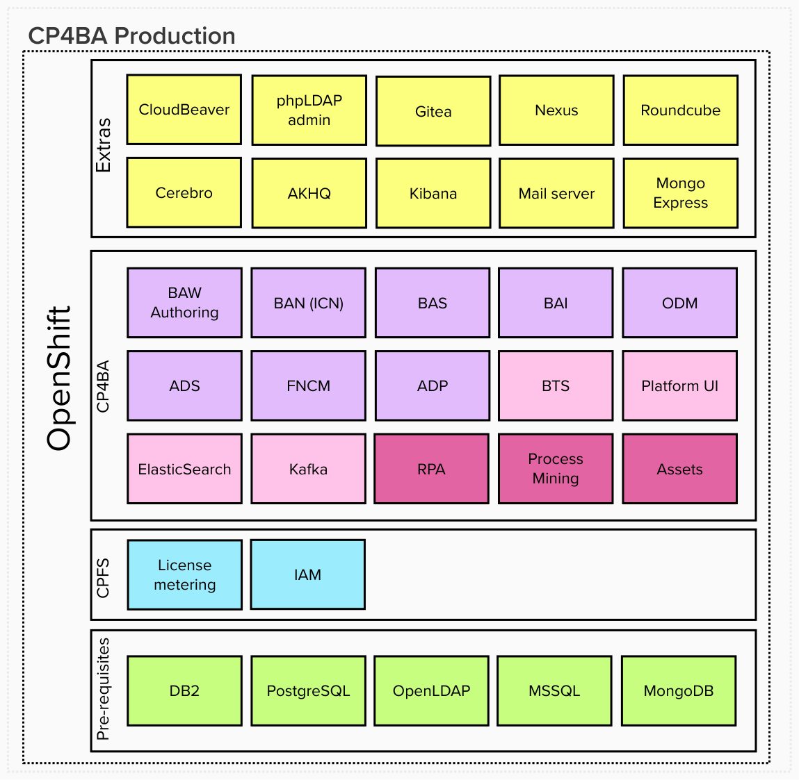

# Cloud Pak for Business Automation<!-- omit in toc -->

Contains CP4BA version 25.0.0-IF001.  
Contains IPM version 2.1.0.
Contains RPA version 30.0.1.

- [Disclaimer ✋](#disclaimer-)
- [Documentation base 📝](#documentation-base-)
- [Benefits 🚀](#benefits-)
- [General information 📢](#general-information-)
- [What is in the package 📦](#what-is-in-the-package-)
- [Environments used for installation 💻](#environments-used-for-installation-)
- [Automated post-deployment tasks ✅](#automated-post-deployment-tasks-)
- [Usage \& operations 📇](#usage--operations-)
- [Optional post deployment steps 📋](#optional-post-deployment-steps-)
- [Licensing 📑](#licensing-)

## Disclaimer ✋

This is **not** an official IBM documentation.  
Absolutely no warranties, no support, no responsibility for anything.  
Use it on your own risk and always follow the official IBM documentations.  
It is always your responsibility to make sure you are license compliant when using this repository to install IBM Cloud Pak for Business Automation.

Please do not hesitate to create an issue here if needed. Your feedback is appreciated.

**Not for production use (neither dev nor test or prod environments). Suitable for Demo and PoC environments - but with Production deployment.**  

**!Important** - Keep in mind that this deployment contains capabilities (the ones which are not bundled with CP4BA) which are not eligible to run on Worker Nodes covered by CP4BA OCP Restricted licenses. More info on https://www.ibm.com/docs/en/cloud-paks/1.0?topic=clusters-restricted-openshift-entitlement.

## Documentation base 📝

Deploying CP4BA is based on official documentation which is located at https://www.ibm.com/docs/en/cloud-paks/cp-biz-automation.

Deployment of other parts is also based on respective official documentations.

- IBM Robotic Process Automation (RPA) https://www.ibm.com/docs/en/rpa
- IBM Process Mining https://www.ibm.com/docs/en/process-mining/
- IBM Cloud Pak Foundational Services (CPFS) https://www.ibm.com/docs/en/cloud-paks/foundational-services

## Benefits 🚀

- Automatic deployment of the whole platform where you don't need to take care about almost any prerequisites
- OCP Ingress certificate is used for Routes so there is only one certificate you need to trust in you local machine to trust all URLs of the whole platform
- Trusted certificate in browser also enable you to save passwords
- Wherever possible a common admin user *cpadmin* with adjustable password is used, so you don't need to remember multiple credentials when you want to access the platform (convenience also comes with responsibility - so you don't want to expose your platform to whole world)
- The whole platform is running on containers, so you don't need to manually prepare anything on traditional VMs and take care of them including required prerequisites
- Many otherwise manual post-deployment steps have been automated
- Pre integrated and automatically connected extras are deployed in the platform for easier access/management/troubleshooting
- You have a working Production deployment which you can use as a reference for further custom deployments

## General information 📢

What is not included:

- ICCs - not covered.
- FNCM External share - Currently not supported with ZEN & IAM as per limitation on [FNCM limitations](https://www.ibm.com/docs/en/cloud-paks/cp-biz-automation/22.0.1?topic=notes-known-limitations-issues#concept_gmf_x1h_1fb__ecm)
- Asset Repository - it is more part of CP4I.
- Workflow Server and Workstream Services - this is a dev deployment. BAW Authoring and (BAW + IAWS) are mutually exclusive in single project.
- ADP Runtime deployment - this is a dev deployment.

You can review the code [here](https://github.com/IBM/cloud-pak-deployer/blob/main/automation-roles/50-install-cloud-pak/cp4ba/config/tasks/main.yml) and [here](https://github.com/IBM/cloud-pak-deployer/blob/main/automation-roles/50-install-cloud-pak/cp4ba/cp4ba-cluster/tasks/install.yml) to directly view how certain components are enabled based on parameter settings.

## What is in the package 📦

Only fully configured CP4BA, RPA and IPM including all Extras and Prerequisites is validated. As validation activities have NOT been executed using partial components, please report any issues you may encounter.

More details about each section from the picture follows below it.

### Extras section<!-- omit in toc -->

Contains extra software which makes working with the platform even easier.

- phpLDAPadmin - Web UI for OpenLDAP directory making it easier to admin and troubleshoot the LDAP.
  - Installed if enabled in configuration (default).
- Gitea - Contains Git server with web UI and is used for ADS and ADP for project sharing and publishing. Organizations for ADS and APD are automatically created. Gitea is connected to OpenLDAP for authentication and authorization.
  - Installed if ADS or Document Processing is enabled.
- Nexus - Repository manager which contains pushed ADS java libraries needed for custom development and also for publishing custom ADS jars. Nexus is connected to OpenLDAP for authentication and authorization.
  - Installed if ADS is enabled.
- Roundcube - Web UI for included Mail server to be able to browse incoming emails.
  - Installed if enabled in configuration (default) and if Mail server (below) is installed.
- Cerebro - Web UI elastic search browser automatically connected to ES instance deployed with CP4BA.
  - Installed if enabled in configuration (default) and if BAI or BAW is enabled.
- AKHQ - Web UI kafka browser automatically connected to Kafka instance deployed with CP4BA.
  - Installed if enabled in configuration (default) and if BAI or BAW with Kafka feature is enabled.
- OpenSearch Dashboards - Web UI OpenSearch dashboard tool automatically connected to OpenSearch instance deployed with CP4BA.
  - Installed if enabled in configuration (default) and if BAI or BAW is enabled.
- Mail server - For various mail integrations e.g. from BAN, BAW and RPA.
  - Installed if CP4BA or RPA is enabled.
- CloudBeaver - Web UI for Postgresql and MSSQL databases making it easier to admin and troubleshoot the DBs.
  - Installed if enabled in configuration (default) and if PostgreSQL or MSSQL (from [Pre-requisites](#pre-requisites-section)) is installed.

### CP4BA (Cloud Pak for Business Automation) section<!-- omit in toc -->

#### CP4BA capabilities<!-- omit in toc -->

CP4BA capabilities are in purple color.

More info for CP4BA capabilities is available in official docs at https://www.ibm.com/docs/en/cloud-paks/cp-biz-automation/latest.

More specifically in overview of patterns at https://www.ibm.com/docs/en/cloud-paks/cp-biz-automation/latest?topic=deployment-capability-patterns-production-deployments.

Pink color is used for CPFS dedicated capabilities.

More info for CPFS dedicated capabilities is available in official docs at https://www.ibm.com/docs/en/cloud-paks/foundational-services/latest.

Magenta color is used for additional capabilities.

More info for Process Mining is available in official docs at https://www.ibm.com/docs/en/process-mining/latest.

More info for RPA is available in official docs at https://www.ibm.com/docs/en/rpa/latest.

Assets are currently not deployed.

### CPFS (Cloud Pak Foundational Services) section<!-- omit in toc -->

Contains services which are reused by Cloud Paks.

More info available in official docs at https://www.ibm.com/docs/en/cpfs.

- License service - Tracks license usage.
- Certificate Manager - Provides certificate handling.

### Pre-requisites section<!-- omit in toc -->

Contains prerequisites for the whole platform.

- PostgreSQL - Database storage for the majority of capabilities.
  - Installed if CP4BA or IPM is enabled.
- OpenLDAP - Directory solution for users and groups definition.
  - Always installed.
- MSSQL server - Database storage for RPA server. 
  - nstalled if RPA is enbled.

## Environments used for installation 💻

With proper sizing of the cluster and provided RWX File and RWO Block Storage Class, CP4BA deployed with Deployer should be working on any OpenShift 4.16 with Worker Nodes which in total have free 96 CPU, 384GB Memory for requests.

## Automated post-deployment tasks ✅

For your convenience the following post-deployment setup tasks have been automated:

- CPFS - OpenSearch cpadmin user added as admin.
- Zen - Users and Groups added.
- Zen - Administrative group is given all available privileges from all pillars.
- Zen - Regular groups are given developer privileges from all pillars.
- Zen - Service account created in CPFS IM and Zen and Zen API key is generated for convenient and stable usage.
- Zen - OCP Ingress certificate is used for better SSL trusting.
- Workforce Insights - Connection setup. You just need to create WFI dashboard. https://www.ibm.com/docs/en/cloud-paks/cp-biz-automation/22.0.1?topic=secrets-creating-custom-bpc-workforce-secret
- ADS - Nexus connection setup and all ADS plugins loaded.
- ADS - Organization in Git created. https://www.ibm.com/docs/en/cloud-paks/cp-biz-automation/22.0.1?topic=gst-task-2-connecting-git-repository-sharing-decision-service
- ADS - Automatic Git project connection. https://www.ibm.com/docs/en/cloud-paks/cp-biz-automation/22.0.1?topic=services-connecting-remote-repository-automatically
- ADS - Roles assigned to users and groups. https://www.ibm.com/docs/en/cloud-paks/cp-biz-automation/24.0.0?topic=services-managing-user-permissions
- ADS - Precreation of GenAI Secret. https://www.ibm.com/docs/en/cloud-paks/cp-biz-automation/24.0.0?topic=services-configuring-generative-ai-secret
- ODM - Service user credentials automatically assigned to servers.
- ODM - Roles assigned to users and groups. https://www.ibm.com/docs/en/cloud-paks/cp-biz-automation/24.0.0?topic=access-managing-user-permissions
- ADP - Organization in Git created. https://www.ibm.com/docs/en/cloud-paks/cp-biz-automation/22.0.1?topic=processing-setting-up-remote-git-organization
- ADP - Default project data loaded. https://www.ibm.com/docs/en/cloud-paks/cp-biz-automation/22.0.1?topic=processing-loading-default-sample-data
- ADP - Git connection and CDD repo creation done. https://www.ibm.com/docs/en/cloud-paks/cp-biz-automation/24.0.1?topic=processing-setting-up-remote-git-organization
- ADP - More project DBs created (6 in total - accommodates 3 ADP projects). https://www.ibm.com/docs/en/cloud-paks/cp-biz-automation/24.0.0?topic=processing-creating-additional-project-databases
- IER - Task Manager pod has TM_JOB_URL parameter set.
- IER - Task manager set up with CPE JARs required by IER.
- Task manager - Enabled in Navigator.
- FNCM - Enabled search result highlighting for Simple Search for FNCM (OS1), IER (FPOS, ROS), BAW (BAWTOS, BAWDOS, BAWDOCS), AE (AEOS) and ADP (DEVOS1) objectstores.
- FNCM - Set default storage policy for Document class and its subclasses to FileSystem based ASA instead of DB.
- BAW - tw_admins enhanced with LDAP admin groups.
- BAW - tw_authors enhanced with LDAP user and admin groups.
- BAW - Created FileNet Subscription for ECM Content event in BAWTOS Object Store. https://www.ibm.com/docs/en/baw/24.x?topic=events-using-event-handler-filenet-content-manager
- BAW - Enable Case History on FNCM Domain level as a prerequisite for Timeline Visualizer. https://www.ibm.com/docs/en/cloud-paks/cp-biz-automation/24.0.1?topic=widgets-timeline-visualizer
- BAW - Added stub configurations for watsonx.ai integration. https://www.ibm.com/docs/en/cloud-paks/cp-biz-automation/24.0.1?topic=customizing-enabling-generative-ai
- BAW - Enabled Process Admin audit log. https://www.ibm.com/docs/en/cloud-paks/cp-biz-automation/24.0.1?topic=customizing-enabling-audit-log
- BAW - Added stub configurations for Git integration. https://www.ibm.com/docs/en/cloud-paks/cp-biz-automation/24.0.1?topic=integration-integrating-github
- BAI - extra flink task manager added for custom event processing.
- RPA - Bot Developer permission added to administrative user.
- IPM - Task mining related permissions added to admin user.
- IPM - Task mining admin user enabled for TM agent usage.
- IPM - Prescriptive mining permissions assigned to admin user.

## Usage & operations 📇

Endpoints, access info and other useful information is available in Project *cloud-pak-deployer* in ConfigMap *cp4ba-usage* in *usage.md* file after installation. It is best to copy the contents and open it in nice MarkDown editor like VSCode. The ConfigMap name can begin with a different name if you customized main CP4BA project name.

## Optional post deployment steps 📋

CP4BA  
Review and perform post deploy manual steps for CP4BA as specified in Project *cloud-pak-deployer* in ConfigMap *cp4ba-postdeploy* in *postdeploy.md* file. It is best to copy the contents and open it in nice MarkDown editor like VSCode. The ConfigMap name can begin with a different name if you customized main CP4BA project name.

RPA  
Review and perform post deploy manual steps for RPA as specified in Project *cloud-pak-deployer* in ConfigMap *cp4ba-rpa-postdeploy* in *postdeploy.md* file. It is best to copy the contents and open it in nice MarkDown editor like VSCode. The ConfigMap name can begin with a different name if you customized main CP4BA project name.

Process Mining  
Review and perform post deploy manual steps for IPM as specified in Project *cloud-pak-deployer* in ConfigMap *cp4ba-pm-postdeploy* in *postdeploy.md* file. It is best to copy the contents and open it in nice MarkDown editor like VSCode. The ConfigMap name can begin with a different name if you customized main CP4BA project name.

## Licensing 📑

Referrence to licenses of used tools apart from those from IBM

- phpLDAPadmin
    - MIT License https://github.com/osixia/docker-phpLDAPadmin/blob/stable/LICENSE (OSI approved https://opensource.org/license/mit)
- Gitea
    - MIT License https://github.com/go-gitea/gitea/blob/main/LICENSE (OSI approved https://opensource.org/license/mit)
- Nexus
    - Own EULA at https://www.sonatype.com/dnt/usage/community-edition-eula https://help.sonatype.com/en/ce-onboarding.html Source at https://help.sonatype.com/en/ce-onboarding.html#what-is-sonatype-nexus-repository-community-edition- states that "Sonatype Nexus Repository Community Edition is the perfect solution to help individual developers and small teams manage their components effectively—for free!". Accepted during the deployment using REST API.
- Roundcube
    - GNU General Public License v3.0 https://github.com/roundcube/roundcubemail/blob/master/LICENSE (OSI approved https://opensource.org/license/gpl-3-0)
    - Also using PostgreSQL - The PostgreSQL License https://www.postgresql.org/about/licence/ (OSI approved https://opensource.org/license/postgresql)
    - Also using NGINX - BSD 2-Clause "Simplified" Licenseh ttps://github.com/nginx/nginx/blob/master/LICENSE (OSI approved https://opensource.org/license/bsd-2-clause)
- Cerebro
    - MIT License https://github.com/lmenezes/cerebro/blob/main/LICENSE (OSI approved https://opensource.org/license/mit)
- AKHQ
    - Apache License 2.0 https://github.com/tchiotludo/akhq/blob/dev/LICENSE (OSI Approved https://opensource.org/license/apache-2-0)
- OpenSearch Dashboards
    - Apache License 2.0 https://github.com/opensearch-project/OpenSearch-Dashboards/blob/main/LICENSE.txt (OSI Approved https://opensource.org/license/apache-2-0)
- Mail server
    - MIT License https://github.com/docker-mailserver/docker-mailserver/blob/master/LICENSE (OSI approved https://opensource.org/license/mit)
- CloudBeaver
    - Apache License 2.0 https://github.com/dbeaver/cloudbeaver/blob/devel/LICENSE (OSI Approved https://opensource.org/license/apache-2-0)
- PostgreSQL
    - PostgreSQL itself - The PostgreSQL License https://www.postgresql.org/about/licence/ (OSI approved https://opensource.org/license/postgresql)
    - Bitnami package - Apache License 2.0 https://github.com/bitnami/containers/tree/main/bitnami/postgresql#license (OSI Approved https://opensource.org/license/apache-2-0)
- OpenLDAP
    - OpenLDAP itself - OpenLDAP Public License https://git.openldap.org/openldap/openldap/-/blob/master/LICENSE?ref_type=heads (OSI approved https://opensource.org/license/oldap-2-8)
    - Bitnami package - https://github.com/bitnami/containers/tree/main/bitnami/openldap#license
- MSSQL server
    - Uses Developer Edition, description at https://learn.microsoft.com/en-us/sql/sql-server/editions-and-components-of-sql-server-2022?view=sql-server-ver16#sql-server-editions