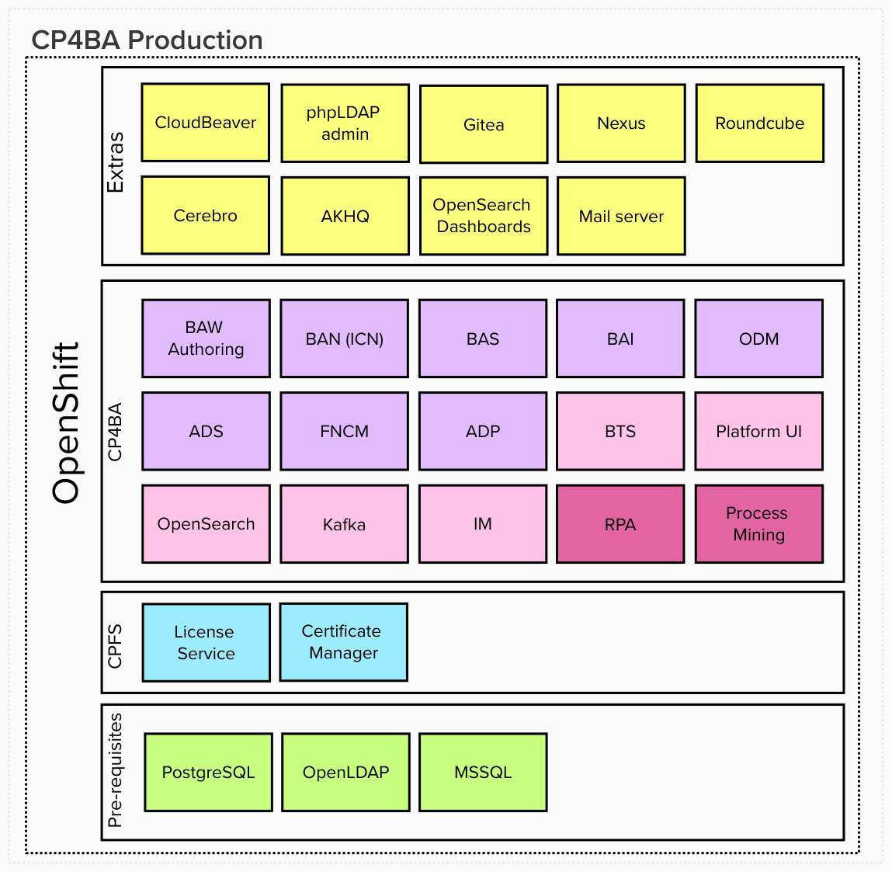

# Cloud Pak for Business Automation<!-- omit in toc -->

Contains CP4BA version 23.0.2 iFix 3.  
RPA and Process Mining are currently not deployed due to discrepancy in Cloud Pak Foundational Services version.  
Contains IPM version 1.14.4.
~~Contains RPA version 23.0.15.~~

- [Disclaimer ✋](#disclaimer-)
- [Documentation base 📝](#documentation-base-)
- [Benefits 🚀](#benefits-)
- [General information 📢](#general-information-)
- [What is in the package 📦](#what-is-in-the-package-)
- [Environments used for installation 💻](#environments-used-for-installation-)
- [Automated post-deployment tasks ✅](#automated-post-deployment-tasks-)
- [Usage \& operations 📇](#usage--operations-)
- [Optional post deployment steps ➡️](#optional-post-deployment-steps-️)

## Disclaimer ✋

This is **not** an official IBM documentation.  
Absolutely no warranties, no support, no responsibility for anything.  
Use it on your own risk and always follow the official IBM documentations.  
It is always your responsibility to make sure you are license compliant when using this repository to install IBM Cloud Pak for Business Automation.

Please do not hesitate to create an issue here if needed. Your feedback is appreciated.

**Not for production use (neither dev nor test or prod environments). Suitable for Demo and PoC environments - but with Production deployment.**  

**!Important** - Keep in mind that this deployment contains capabilities (the ones which are not bundled with CP4BA) which are not eligible to run on Worker Nodes covered by CP4BA OCP Restricted licenses. More info on https://www.ibm.com/docs/en/cloud-paks/1.0?topic=clusters-restricted-openshift-entitlement.

## Documentation base 📝

Deploying CP4BA is based on official documentation which is located at https://www.ibm.com/docs/en/cloud-paks/cp-biz-automation/latest.

Deployment of other parts is also based on respective official documentations.

- IBM Robotic Process Automation (RPA) https://www.ibm.com/docs/en/rpa/latest?topic=installing-rpa-red-hat-openshift-container-platform
- IBM Automation Assets https://www.ibm.com/docs/en/cloud-paks/1.0?topic=foundation-automation-assets
- IBM Process Mining https://www.ibm.com/docs/en/process-mining/latest?topic=installing-red-hat-openshift-container-platform-environments
- IBM Automation Foundation (IAF) https://www.ibm.com/docs/en/cloud-paks/1.0?topic=automation-foundation
- IBM Cloud Pak Foundational Services (CPFS) https://www.ibm.com/docs/en/cpfs?topic=operator-installing-foundational-services-online

## Benefits 🚀

- Automatic deployment of the whole platform where you don't need to take care about almost any prerequisites
- OCP Ingress certificate is used for Routes so there is only one certificate you need to trust in you local machine to trust all URLs of the whole platform
- Trusted certificate in browser also enable you to save passwords
- Wherever possible a common admin user *cpadmin* with adjustable password is used, so you don't need to remember multiple credentials when you want to access the platform (convenience also comes with responsibility - so you don't want to expose your platform to whole world)
- The whole platform is running on containers, so you don't need to manually prepare anything on traditional VMs and take care of them including required prerequisites
- Many otherwise manual post-deployment steps have been automated
- Pre integrated and automatically connected extras are deployed in the platform for easier access/management/troubleshooting
- You have a working Production deployment which you can use as a reference for further custom deployments

## General information 📢

What is not included:

- ICCs - not covered.
- FNCM External share - Currently not supported with ZEN & IAM as per limitation on [FNCM limitations](https://www.ibm.com/docs/en/cloud-paks/cp-biz-automation/22.0.1?topic=notes-known-limitations-issues#concept_gmf_x1h_1fb__ecm)
- Asset Repository - it is more part of CP4I.
- Workflow Server and Workstream Services - this is a dev deployment. BAW Authoring and (BAW + IAWS) are mutually exclusive in single project.
- ADP Runtime deployment - this is a dev deployment.

## What is in the package 📦

When you perform full deployment, as a result you will get full CP4BA platform as seen in the picture. You can also omit some capabilities - this is covered later in this doc.

More details about each section from the picture follows below it.

### Extras section<!-- omit in toc -->

Contains extra software which makes working with the platform even easier.

- phpLDAPadmin - Web UI for OpenLDAP directory making it easier to admin and troubleshoot the LDAP.
- Gitea - Contains Git server with web UI and is used for ADS and ADP for project sharing and publishing. Organizations for ADS and APD are automatically created. Gitea is connected to OpenLDAP for authentication and authorization.
- Nexus - Repository manager which contains pushed ADS java libraries needed for custom development and also for publishing custom ADS jars. Nexus is connected to OpenLDAP for authentication and authorization.
- Roundcube - Web UI for included Mail server to be able to browse incoming emails.
- Cerebro - Web UI elastic search browser automatically connected to ES instance deployed with CP4BA.
- AKHQ - Web UI kafka browser automatically connected to Kafka instance deployed with CP4BA.
- OpenSearch Dashboards - Web UI OpenSearch dashboard tool automatically connected to OpenSearch instance deployed with CP4BA.
- Mail server - For various mail integrations e.g. from BAN, BAW and RPA.
- Mongo Express - Web UI for Mongo DB databases for CP4BA and Process Mining to easier troubleshoot DB.
- CloudBeaver - Web UI for Postgresql and MSSQL databases making it easier to admin and troubleshoot the DBs.

### CP4BA (Cloud Pak for Business Automation) section<!-- omit in toc -->

#### CP4BA capabilities<!-- omit in toc -->

CP4BA capabilities are in purple color.

More info for CP4BA capabilities is available in official docs at https://www.ibm.com/docs/en/cloud-paks/cp-biz-automation/latest.

More specifically in overview of patterns at https://www.ibm.com/docs/en/cloud-paks/cp-biz-automation/latest?topic=deployment-capabilities-production-deployments.

Pink color is used for CPFS dedicated capabilities.

More info for CPFS dedicated capabilities is available in official docs at https://www.ibm.com/docs/en/cloud-paks/foundational-services/latest.

Magenta color is used for additional capabilities.

More info for Process Mining is available in official docs at https://www.ibm.com/docs/en/process-mining/latest.

More info for RPA is available in official docs at https://www.ibm.com/docs/en/rpa/latest.

Assets are currently not deployed.

### CPFS (Cloud Pak Foundational Services) section<!-- omit in toc -->

Contains services which are reused by Cloud Paks.

More info available in official docs at https://www.ibm.com/docs/en/cpfs.

- License metering - Tracks license usage.
- Certificate Manager - Provides certificate handling.

### Pre-requisites section<!-- omit in toc -->

Contains prerequisites for the whole platform.

- PostgreSQL - Database storage for the majority of capabilities.
- OpenLDAP - Directory solution for users and groups definition.
- MSSQL server - Database storage for RPA server.
- MongoDB - Database storage for ADS and Process Mining.

## Environments used for installation 💻

With proper sizing of the cluster and provided RWX File and RWO Block Storage Class, CP4BA deployed with Deployer should be working on any OpenShift 4.14 with Worker Nodes which in total have free 60 CPU, 128GB Memory for requests.

## Automated post-deployment tasks ✅

For your convenience the following post-deployment setup tasks have been automated:

- CPFS - OCP Ingress certificate is used for better SSL trusting.
- Zen - Users and Groups added.
- Zen - Administrative group is given all available privileges from all pillars.
- Zen - Regular groups are given developer privileges from all pillars.
- Zen - Service account created in CPFS IAM and Zen and Zen API key is generated for convenient and stable usage.
- Zen - OCP Ingress certificate is used for better SSL trusting.
- Workforce Insights - Connection setup. You just need to create WFI dashboard. https://www.ibm.com/docs/en/cloud-paks/cp-biz-automation/22.0.1?topic=secrets-creating-custom-bpc-workforce-secret
- ADS - Nexus connection setup and all ADS plugins loaded.
- ADS - Organization in Git created. https://www.ibm.com/docs/en/cloud-paks/cp-biz-automation/22.0.1?topic=gst-task-2-connecting-git-repository-sharing-decision-service
- ADS - Automatic Git project connection https://www.ibm.com/docs/en/cloud-paks/cp-biz-automation/22.0.1?topic=services-connecting-remote-repository-automatically
- ODM - Service user credentials automatically assigned to servers.
- ADP - Organization in Git created. https://www.ibm.com/docs/en/cloud-paks/cp-biz-automation/22.0.1?topic=processing-setting-up-remote-git-organization
- ADP - Default project data loaded. https://www.ibm.com/docs/en/cloud-paks/cp-biz-automation/22.0.1?topic=processing-loading-default-sample-data
- ADP - Git connection and CDD repo creation done. https://www.ibm.com/docs/en/cloud-paks/cp-biz-automation/latest?topic=processing-setting-up-remote-git-organization
- IER - Task Manager pod has TM_JOB_URL parameter set.
- IER - Task manager set up with CPE JARs required by IER.
- Task manager - Enabled in Navigator.
- BAW - tw_admins enhanced with LDAP admin groups.
- BAW - tw_authors enhanced with LDAP user and admin groups.
- BAI - extra flink task manager added for custom event processing.
- RPA - Bot Developer permission added to administrative user.
- IPM - Task mining related permissions added to admin user.
- IPM - Task mining admin user enabled for TM agent usage.

## Usage & operations 📇

Endpoints, access info and other useful information is available in Project *cloud-pak-deployer* in ConfigMap *cp4ba-usage* in *usage.md* file after installation. It is best to copy the contents and open it in nice MarkDown editor like VSCode. The ConfigMap name can begin with a different name if you customized main CP4BA project name.

## Optional post deployment steps ➡️

CP4BA  
Review and perform post deploy manual steps for CP4BA as specified in Project *cloud-pak-deployer* in ConfigMap *cp4ba-postdeploy* in *postdeploy.md* file. It is best to copy the contents and open it in nice MarkDown editor like VSCode. The ConfigMap name can begin with a different name if you customized main CP4BA project name.

RPA  
Review and perform post deploy manual steps for RPA as specified in Project *cloud-pak-deployer* in ConfigMap *cp4ba-rpa-postdeploy* in *postdeploy.md* file. It is best to copy the contents and open it in nice MarkDown editor like VSCode. The ConfigMap name can begin with a different name if you customized main CP4BA project name.

Process Mining  
Review and perform post deploy manual steps for IPM as specified in Project *cloud-pak-deployer* in ConfigMap *cp4ba-pm-postdeploy* in *postdeploy.md* file. It is best to copy the contents and open it in nice MarkDown editor like VSCode. The ConfigMap name can begin with a different name if you customized main CP4BA project name.
