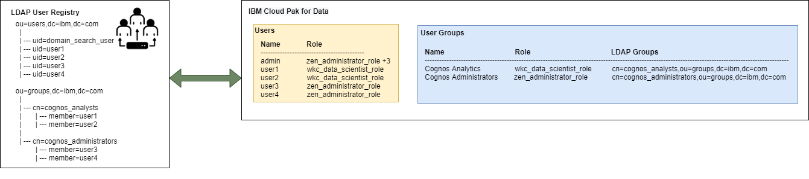
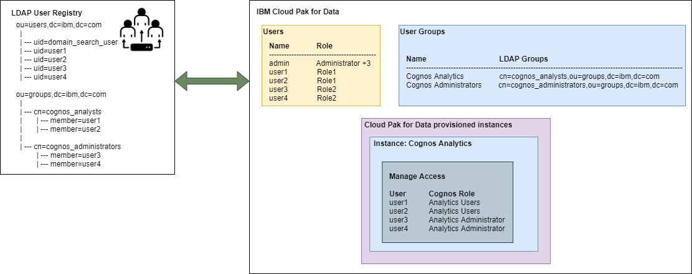

# Cloud Pak for Data access control

Cloud Pak for Data can connect to an external identity provider (IdP) for user authentication. This function is delegated to Foundational Services IAM. Additional to user authentication, the IdP's groups can be mapped to Cloud Pak for Data user groups for access control.

### Roles - `zen_role`
Cloud Pak Deployer can be used to define user-defined roles in Cloud Pak for Data. Roles identify the permissions that a user or user group has on the platform.

```
zen_role:
- name: monitor-role
  description: User-defined role for monitoring the platform
  state: installed
  permissions:
  - monitor_platform
```

#### Property explanation
| Property               | Description                                                                            | Mandatory | Allowed values |
| ---------------------- | -------------------------------------------------------------------------------------- | --------- | -------------- |
| name                   | Name of the Cloud Pak for Data role                                                    | Yes       |                |
| description            | Description of the Cloud Pak for Data role                                             | Yes       |                |
| state                  | Indicates if the role must be installed or removed same OpenShift cluster              | No        | installed (default), removed |
| permissions[]          | List of permissions to grant to the role                                               | Yes       |                |

To find the permissions that are allows, you can use the following REST API (GET) after authenticating to the platform: https://$CP4D_URL/icp4d-api/v1/permissions.

### Access Control - `zen_access_control`
The `zen_access_control` object controls the creation of Zen user groups that map identify provider (IdP) groups and define the roles of the user group. A `user_groups` entry must contain at least 1 `roles` and must reference the associated IdP grouop(s).

#### Example with Red Hat SSO (Keycloak) authentication

The below configuration references a keycloak (Red Hat SSO) configuration. For the Red hat SSO configuration, refer to [openshift_redhat_sso](./redhat-sso.md).

```
zen_access_control:
- project: cpd
  openshift_cluster_name: "{{ env_id }}"
  keycloak_name: ibm-keycloak
  user_groups:
  - name: cp4d-admins
    description: Cloud Pak for Data Administrators
    roles:
    - Administrator
    keycloak_groups:
    - kc-cp4d-admins
  - name: cp4d-data-engineers
    description: Cloud Pak for Data Data Engineers
    roles:
    - User
    keycloak_groups:
    - kc-cp4d-data-engineers
  - name: cp4d-data-scientists
    description: Cloud Pak for Data Data Scientists
    roles:
    - User
    keycloak_groups:
    - kc-cp4d-data-scientists
  - name: cp4d-monitor
    description: Cloud Pak for Data monitoring
    roles:
    - monitor-role
    keycloak_groups:
    - kc-cp4d-monitor
```

#### Example with LDAP authentication

The below configuration references an LDAP configuration. For the LDAP configuration, refer to [ldap](./ldap.md).

```
zen_access_control:
- project: cpd
  openshift_cluster_name: "{{ env_id }}"
  ldap_names:
  - cp4d-ldap
  user_groups:
  - name: cp4d-admins
    description: Cloud Pak for Data Administrators
    roles:
    - Administrator
    ldap_groups:
    - cn=cp4d-admins,ou=Groups,dc=cp,dc=internal
  - name: cp4d-data-engineers
    description: Cloud Pak for Data Data Engineers
    roles:
    - User
    ldap_groups:
    - cn=cp4d-data-engineers,ou=Groups,dc=cp,dc=internal
  - name: cp4d-data-scientists
    description: Cloud Pak for Data Data Scientists
    roles:
    - User
    ldap_groups:
    - cn=cp4d-data-scientists,ou=Groups,dc=cp,dc=internal
  - name: cp4d-monitor
    description: Cloud Pak for Data monitoring
    roles:
    - monitor-role
    ldap_groups:
    - cn=cp4d-monitor,ou=Groups,dc=cp,dc=internal
```

#### Example with OpenLDAP authentication

The below configuration references an Demo OpenLDAP configuration. For the Demo OpenLDAP configuration, refer to [demo_openldap](./demo-openldap.md).

```
zen_access_control:
- project: cpd
  openshift_cluster_name: "{{ env_id }}"
  demo_openldap_names:
  - ibm-openldap
  user_groups:
  - name: cp4d-admins
    description: Cloud Pak for Data Administrators
    roles:
    - Administrator
    ldap_groups:
    - cn=cp4d-admins,ou=Groups,dc=cp,dc=internal
  - name: cp4d-data-engineers
    description: Cloud Pak for Data Data Engineers
    roles:
    - User
    ldap_groups:
    - cn=cp4d-data-engineers,ou=Groups,dc=cp,dc=internal
  - name: cp4d-data-scientists
    description: Cloud Pak for Data Data Scientists
    roles:
    - User
    ldap_groups:
    - cn=cp4d-data-scientists,ou=Groups,dc=cp,dc=internal
  - name: cp4d-monitor
    description: Cloud Pak for Data monitoring
    roles:
    - monitor-role
    ldap_groups:
    - cn=cp4d-monitor,ou=Groups,dc=cp,dc=internal
```





#### Property explanation
| Property               | Description                                                                            | Mandatory | Allowed values |
| ---------------------- | -------------------------------------------------------------------------------------- | --------- | -------------- |
| project                | `project` of the `cp4d` instance                                                       | Yes       |                |
| openshift_cluster_name | Reference to the `openshift` name                                                      | Yes       |                |
| keycloak_name          | Name of the Red Hat SSO (Keycloak) instance on the same OpenShift cluster              | No        |                |
| demo_openldap_names[]  | Names of the demo OpenLDAP instances defined in the `demo_openldap` resource           | No        |                |
| user_groups[]          | Cloud Pak for Data user groups to be configured                                        | Yes       |                |
| .name                  | Name of the CP4D user group                                                            | Yes       |                |
| .description           | Description of the CP4D user group                                                     | No        |                |
| .roles[]               | List of CP4D roles to assign to the user grouop                                        | Yes       |                |
| .keycloak_groups[]     | List of Red Hat SSO (Keycloak) groups to assign to the CP4D user group                 | Yes if IdP is Keycloak |   |
| .ldap_groups[]         | List of OpenLDAP groups to assign to the CP4D user group                               | Yes if IdP is OpenLDAP |   |

**`role` values:**
The following roles are defined by default in Cloud Pak for Data:
- Administrator
- User

Further roles can be defined in the `zen` object and can be referenced by the `user_groups.roles[]` property.

During the creation of User Group(s) the following validations are performed:
- The provided role(s) are available in Cloud Pak for Data

### Provisioned instance authorization - `cp4d_instance_configuration`
When using Cloud Pak for Data LDAP connectivity and User Groups, the User Groups can be assigned to authorize the users of the LDAP groups access to the proviosioned instance(s).

Currently supported instance authorization:  
- Cognos Analytics (ca)

#### Cognos Analytics instance authorization



```
cp4d_instance_configuration:
- project: zen-sample                # Mandatory
  openshift_cluster_name: sample     # Mandatory
  cartridges:
  - name: cognos_analytics
    manage_access:                                  # Optional, requires LDAP connectivity
    - ca_role: Analytics Viewer                     # Mandatory, one the CA Access roles
      cp4d_user_group: CA_Analytics_Viewer          # Mandatory, the CP4D User Group Name
    - ca_role: Analytics Administrators             # Mandatory, one the CA Access roles
      cp4d_user_group: CA_Analytics_Administrators  # Mandatory, the CP4D User Group Name
```

A Cognos Analytics (ca) instance can have multiple `manage_access` entries. Each entry consists of 1 `ca_role` and 1 `cp4d_user_group` element. 
The `ca_role` must be one of the following possible values:
- Analytics Administrators
- Analytics Explorers
- Analytics Users 
- Analytics Viewer

During the configuration of the instance authorization the following validations are performend:
- LDAP configuration is completed
- The provided `ca_role` is valid
- The provided `cp4d_user_group` exists