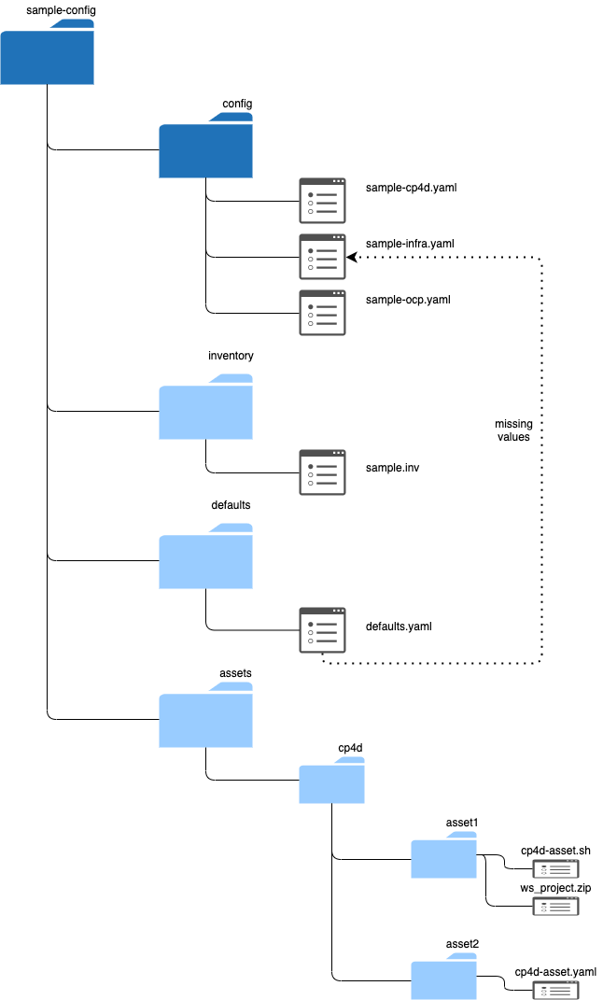

# Cloud Pak Deployer Advanced Configuration

The Cloud Pak Deployer includes several samples which you can use to build your own configuration. You can find sample configuration `yaml` files in the sub-directories of the `sample-configurations` directory of the repository. Descriptions and topologies are also included in the sub-directories.

!!! warning
    Do not make changes to the sample configurations in the `cloud-pak-deployer` directory, but rather copy it to your own home directory or somewhere else and then make changes. If you store your own configuration under the repository's clone, you may not be able to update (pull) the repository with changes applied on GitHub, or accidentally overwrite it.

!!! warning
    The deployer expects to manage all objects referenced in the configuration files, including the referenced OpenShift cluster and Cloud Pak installation. If you have already pre-provisioned the OpenShift cluster, choose a configuration with `existing-ocp` cloud platform. If the Cloud Pak has already been installed, unexpected and undesired activities may happen. The deployer has not been designed to alter a pre-provisioned OpenShift cluster or existing Cloud Pak installation.

## Configuration steps - static sample configuration
1. Copy the static sample configuration directory to your own directory:
``` { .bash .copy }
mkdir -p $HOME/cpd-config/config
cp -r ./sample-configurations/roks-ocs-cp4d/config/* $HOME/cpd-config/config/
cd $HOME/cpd-config/config
```
2. Edit the "cp4d-....yaml" file and select the cartridges to be installed by changing the state to `installed`. Additionally you can accept the Cloud Pak license in the config file by specifying `accept_licenses: True`.
``` { .bash .copy }
nano ./config/cp4d-450.yaml
```

The configuration typically works without any configuration changes and will create all referenced objects, including the Virtual Private Cloud, subnets, SSH keys, ROKS cluster and OCS storage ndoes. There is typically no need to change address prefixes and subnets. The IP addresses used by the provisioned components are private to the VPC and are not externally exposed.

## Configuration steps - dynamically choose OpenShift and Cloud Pak
1. Copy the sample configuration directory to your own directory:
``` { .bash .copy }
mkdir -p $HOME/cpd-config/config
```
2. Copy the relevant OpenShift configuration file from the `samples-configuration` directory to the `config` directory, for example:
``` { .bash .copy }
cp ./sample-configurations/sample-dynamic/config-samples/ocp-ibm-cloud-roks-ocs.yaml $HOME/cpd-config/config/
```
3. Copy the relevant "cp4d-..." file from the `samples-configuration` directory to the `config` directory, for example:
``` { .bash .copy }
cp ./sample-configurations/sample-dynamic/config-samples/cp4d-462.yaml $HOME/cpd-config/config/
```

4. Edit the "$HOME/cpd-config/config/cp4d-....yaml" file and select the cartridges to be installed by changing the state to `installed`. Additionally you can accept the Cloud Pak license in the config file by specifying `accept_licenses: True`.
``` { .bash .copy }
nano $HOME/cpd-config/config/cp4d-463.yaml
```

For more advanced configuration topics such as using a private registry, setting up transit gateways between VPCs, etc, go to the **Advanced configuration** section

## Directory structure

Every configuration has a fixed directory structure, consisting of mandatory and optional subdirectories.


Mandatory subdirectories:

* `config`: Keeps one or more `yaml` files with your OpenShift and Cloud Pak configuration

Additionally, there are 3 optional subdirectories:

* `defaults`: Directory that keeps the defaults which will be merged with your configuration
* `inventory`: Keep global settings for the configuration such as environment name or other variables used in the configs
* `assets`: Keeps directories of assets which must be deployed onto the Cloud Pak

### `config` directory
You can choose to keep only a single file per subdirectory or, for more complex configurations, you can create multiple yaml files. You can find a full list of all supported object types here: [Configuration objects](../../../30-reference/configuration/cpd-objects). The generator automatically merges all `.yaml` files in the config and defaults directory. Files with different extensions are ignored. In the sample configurations we split configuration of the OpenShift `ocp-...` and Cloud Pak `cp4.-...` objects.

For example, your `config` directory could hold the following files:
``` { .bash .copy }
cp4d-463.yaml
ocp-ibm-cloud-roks-ocs.yaml
```

This will provision a ROKS cluster on IBM Cloud with OpenShift Data Foundation (fka OCS) and Cloud Pak for Data 4.0.8.

### `defaults` directory (optional)
Holds the defaults for all object types. If a certain object property has not been specified in the `config` directory, it will be retrieved from the `defaults` directory using the flavour specified in the configured object. If no flavour has been selected, the `default` flavour will be chosen.

You should not need this subdirectory in most circumstances.

### `assets` directory (optional)
Optional directory holding the assets you wish to deploy for the Cloud Pak. More information about Cloud Pak for Data assets which can be deployed can be found in object definition [cp4d_asset](../../../30-reference/configuration/cp4d-assets). The directory can be named differently as well, for example `cp4d-assets` or `customer-churn-demo`.

### `inventory` directory (optional)
The Cloud Pak Deployer pipeline has been built using Ansible and it can be configured using "inventory" files. Inventory files allow you to specify global variables used throughout Ansible playbooks. In the current version of the Cloud Pak Deployer, the inventory directory has become fully optional as the `global_config` and `vault` objects have taken over its role. However, if there are certain global variables such as `env_id` you want to pass via an inventory file, you can also do this.

## Vault secrets
User passwords, certificates and other "secret" information is kept in the vault, which can be either a flat file (not encrypted), HashiCorp Vault or the IBM Cloud Secrets Manager service. Some of the deployment configurations require that the vault is pre-populated with secrets which as needed during the deployment. For example, a vSphere deployment needs the vSphere user and password to authenticate to vSphere and Cloud Pak for Data SAML configuration requires the idP certificate

All samples default to the **File Vault**, meaning that the vault will be kept in the `vault` directory under the status directory you specify when you run the deployer. Detailed descriptions of the vault settings can be found in the sample inventory file and also here: [vault settings](../../../30-reference/configuration/vault).

Optional: Ensure that the environment variables for the configuration and status directories are set. If not specified, the directories are assumed to be `$HOME/cpd-config` and `$HOME/cpd-status`.
``` { .bash .copy }
export STATUS_DIR=$HOME/cpd-status
export CONFIG_DIR=$HOME/cpd-config
```

Set vSphere user secret:
``` { .bash .copy }
./cp-deploy.sh vault set \
    --vault-secret vsphere-user \
    --vault-secret-value super_user@vsphere.local
```

Or, if you want to create the secret from an input file:
``` { .bash .copy }
./cp-deploy.sh vault set \
    --vault-secret kubeconfig \
    --vault-secret-file ~/.kube/config
```    

## Using a GitHub repository for the configuration

If the configuration is kept in a GitHub repository, you can set environment variables to have the deployer pull the GitHub repository to the current server before starting the process.

Set environment variables.
``` { .bash .copy }
export CPD_CONFIG_GIT_REPO="https://github.com/IBM/cloud-pak-deployer-config.git"
export CPD_CONFIG_GIT_REF="main"
export CPD_CONFIG_GIT_CONTEXT=""
```

- `CPD_CONFIG_GIT_REPO`: The clone URL of the GitHub repository that holds the configuration.
- `CPD_CONFIG_GIT_REF`: The branch, tag or commit ID to be cloned. If not specified, the repository's default branch will be cloned.
- `CPD_CONFIG_GIT_CONTEXT`: The directory within the GitHub repository that holds the configuration. This directory must contain the `config` directory under which the YAML files are kept.

!!! info
    When specifying a GitHub repository, the contents will be copied under `$STATUS_DIR/cpd-config` and this directory is then set as the configuration directory.  

## Using dynamic variables (extra variables)
In some situations you may want to use a single configuration for deployment in different environments, such as development, acceptance test and production. The Cloud Pak Deployer uses the Jinja2 templating engine which is included in Ansible to pre-process the configuration. This allows you to dynamically adjust the configuration based on extra variables you specify at the command line.

Example:
``` { .bash .copy }
./cp-deploy.sh env apply \
  -e ibm_cloud_region=eu_gb \
  -e env_id=jupiter-03 [--accept-all-liceneses]
```

This passes the `env_id` and `ibm_cloud_region` variables to the Cloud Pak Deployer, which can then populate variables in the configuration. In the sample configurations, the `env_id` is used to specify the name of the VPC, ROKS cluster and others and overrides the value specified in the `global_config` definition. The `ibm_cloud_region` overrides region specified in the inventory file.

``` { .yaml .copy }
...
vpc:
- name: "{{ env_id }}"
  allow_inbound: ['ssh']

address_prefix:
### Prefixes for the client environment
- name: "{{ env_id }}-zone-1"
  vpc: "{{ env_id }}"
  zone: {{ ibm_cloud_region }}-1
  cidr: 10.231.0.0/26
...
```

When running with the above `cp-deploy.sh` command, the snippet would be generated as:
``` { .yaml .copy }
...
vpc:
- name: "jupiter-03"
  allow_inbound: ['ssh']

address_prefix:
### Prefixes for the client environment
- name: "jupiter-03-zone-1"
  vpc: "jupiter-03"
  zone: eu-de-1
  cidr: 10.231.0.0/26
...
```

The `ibm_cloud_region` variable is specified in the inventory file. This is another method of specifying variables for dynamic configuration.

You can even include more complex constructs for dynamic configuration, with `if` statements, `for` loops and others.

An example where the OpenShift OCS storage classes would only be generated for a specific environment (pluto-prod) would be:
``` { .yaml .copy }
  openshift_storage:
  - storage_name: nfs-storage
    storage_type: nfs
    nfs_server_name: "{{ env_id }}-nfs"

  - storage_name: ocs-storage
    storage_type: ocs
    ocs_storage_label: ocs
    ocs_storage_size_gb: 500

```

For a more comprehensive overview of Jinja2 templating, see https://docs.ansible.com/ansible/latest/user_guide/playbooks_templating.html