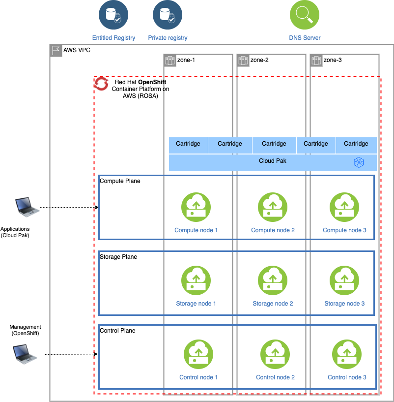

# Managed OpenShift on AWS (ROSA) with ODF storage classes and Cloud Pak for Data
This is a sample configuration for Managed OpenShift on Amazon Web Services (ROSA) with ODF storage and using the entitled registry. Only the OpenShift cluster and Cloud Pak for Data are managed by the deployer and deployment requires AWS an ROSA credentials and a Cloud Pak entitlement key. 

## Infrastructure

## OpenShift
A Red Hat OpenShift on AWS (ROSA) cluster with the specified version (4.8) is provisioned on AWS. By default, the cluster is provisioned across 3 availability zones but this can be disabled by setting `infrastructure.multi_zone` to `False`. In the sample configuration, 3 additional compute nodes are configured for OpenShift Container Storage (OpenShift Data Foundation). For back-end storage for the ODF cluster, the `gp2` storage class is used.

## Cloud Pak for Data
Cloud Pak for Data 4.0 is installed in OpenShift project `cpd`, pulling images from the entitled registry and referencing the ODF storage classes in OpenShift.

### Cartridges
The sample configuration holds a list of cartridges which will be installed. You can control whether cartridges will be installed by commenting or uncommenting the appropriate blocks. Please ensure that the cartridge elements are aligned (hyphens must be aligned with hyphens and properties with properties).

By default, the following cartridges will be installed:
* Cloud Pak Foundational Services (is installed as part of the Cloud Pak for Data control plane)
* Cloud Pak for Data control plane (mandatory)
* Watson Studio
* Watson Machine Learning