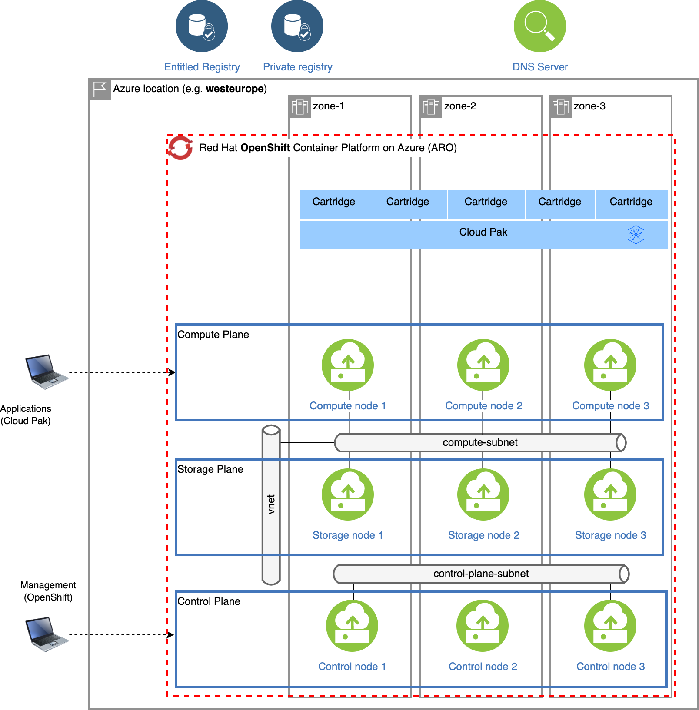

# Managed OpenShift on Azure (ARO) with ODF storage classes and Cloud Pak for Data

This is a sample configuration for Managed OpenShift on Microsoft Azure (ARO) with ODF storage and using the entitled registry. Infrastructure (immutable once provisioned), OpenShift cluster together with Cloud Pak for Data are managed by the deployer and deployment requires tenant and subscription ids, a few service provider object ids, an OpenShift pull secret and a Cloud Pak entitlement key.

## Infrastructure

Infrastructure details must be specified as part of a separate configuration. Once an infrastructure is set up, it becomes immutable, so it cannot be updated even if the base configuration is changed, and the deployer is restarted.

## OpenShift

You cannot choose the version for a Red Hat OpenShift on Azure (ARO) cluster. By default, the latest current version is provisioned automatically instead no matter what value is specified in the `ocp_version` parameter. The `ocp_version` parameter is used to install the correct version of the oc command line tool.

The cluster is provisioned across 3 availability zones. In the sample configuration, 3 additional compute nodes are configured for OpenShift Container Storage (OpenShift Data Foundation). For back-end storage for the ODF cluster, the `managed-premium` storage class is used.

## Cloud Pak for Data

Cloud Pak for Data 4.0 is installed in OpenShift project `cpd`, pulling images from the entitled registry and referencing the ODF storage classes in OpenShift.

### Cartridges

The sample configuration holds a list of cartridges which will be installed. You can control whether cartridges will be installed by commenting or uncommenting the appropriate blocks. Please ensure that the cartridge elements are aligned (hyphens must be aligned with hyphens and properties with properties).

By default, the following cartridges will be installed:

- Cloud Pak Foundational Services (is installed as part of the Cloud Pak for Data control plane)
- Cloud Pak for Data control plane (mandatory)
- Watson Studio
- Watson Machine Learning
