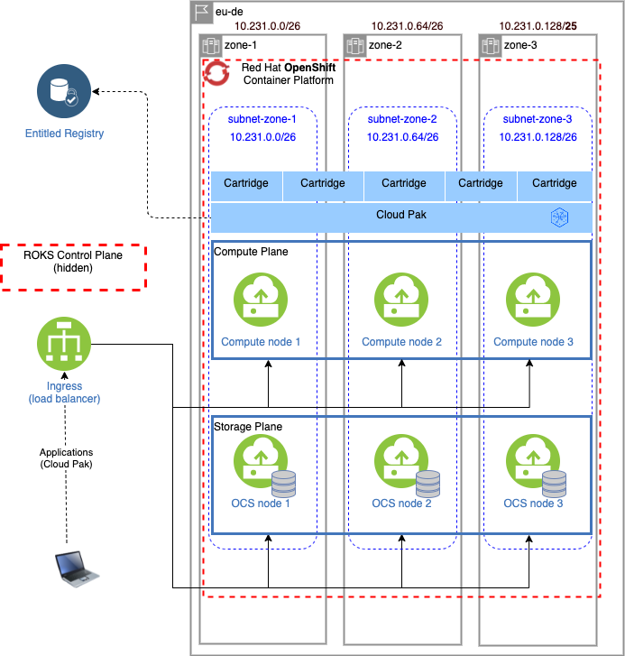

# IBM Cloud ROKS on VPC with ODF storage and Cloud Pak for Data
This is a sample configuration for ROKS on IBM Cloud, provisioned in a VPC with ODF storage. All infrastructure, OpenShift and Cloud Pak for Data are managed by the deployer and deployment requires nothing but an IBM Cloud API key and a Cloud Pak entitlement key.

## Infrastructure

### Virtual Private Cloud on IBM Cloud
The Virtual Private Cloud (VPC) contains all of the assets needed that make up this configuration.

### Zones with address prefixes
The sample configuration is made up of 3 availability zones, each with its own address prefix. Zones 1 and 2 have a netmask of `/26`, which means each zone can provide up to 59 IP addresses (the first 5 addresses in the CIDR block are reserved by IBM Cloud). Zone 3 has a netmask of `/25`, which means it can address 123 IP addresses (128-5).

### Subnets
All zones have a single subnet which spans the entire IP address block.

## OpenShift
An OpenShift cluster with the specified version (4.8) is provisioned inside the VPC and across subnets 1, 2 and 3 and with OpenShift Container Storage (OpenShift Data Foundation) on 3 dedicated storage/compute nodes. As part of the ODF provisioning, 2 storage classes are created: `ocs-storagecluster-cephfs` for file storage and `ocs-storagecluster-ceph-rbd` for block storage.

## Cloud Pak for Data
Cloud Pak for Data 4.0 is installed in OpenShift project `cpd`, pulling images from the IBM entitled registry and referencing the ODF storage class in OpenShift.

### Cartridges
The sample configuration holds a list of cartridges which will be installed. You can control whether cartridges will be installed by commenting or uncommenting the appropriate blocks. Please ensure that the cartridge elements are aligned (hyphens must be aligned with hyphens and properties with properties).

By default, the following cartridges will be installed:
* Cloud Pak Foundational Services (is installed as part of the Cloud Pak for Data control plane)
* Cloud Pak for Data control plane (mandatory)
* Watson Studio
* Watson Machine Learning